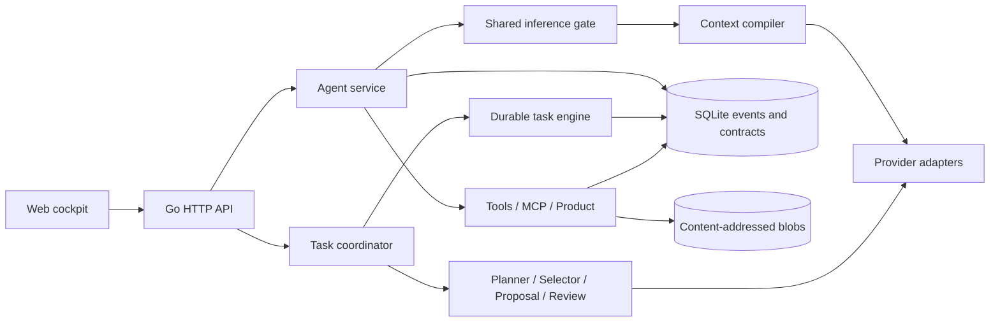

# Hermetrix — detailed review and improvement plan

วันที่ตรวจ: 2026-09-18 · commit: `08fcac4` · สถานะ: Investigated / proposed plan

Implementation specification: [`../specs/2026-09-18-correctness-performance-remediation.md`](../specs/2026-09-18-correctness-performance-remediation.md)

## 1. ข้อสรุป

ระบบมีฐานสถาปัตยกรรมที่เหมาะกับ local-first agent: แยก provider/runtime/tool/skill/task engine, มี immutable contract, event log, approval, effect intent และการกู้สถานะหลัง restart อยู่แล้ว ควรพัฒนาบนฐานนี้ต่อ แต่ยังไม่ควรถือว่าความถูกต้องของ kernel หรือความพร้อมใช้บน Windows ผ่านครบเพียงเพราะ build ผ่าน

รอบนี้ยืนยัน defect ด้วย diagnostic probes 5 เรื่อง ได้แก่ cross-origin mutation, concurrent file save ที่ข้าม optimistic guard, effect dispatch หลัง lease หมดอายุ, model เปลี่ยนระหว่าง approval resume และ SSE ที่จบไม่สมบูรณ์แต่ไม่คืน error นอกจากนี้ existing integration test ยืนยันว่า command verification บน Windows ล้มเหลวจาก child environment

ลำดับที่คุ้มค่าที่สุดคือ **รักษาความถูกต้องของข้อมูลและ authority → ทำ Windows workflow ให้ผ่าน → วัดต้นทุนจริง → แก้ scheduling/history/retrieval → ปรับ UI และแบ่งโมดูล** การเพิ่ม concurrency ก่อนแก้ ownership และ write race จะขยายความเสียหาย

ไม่มี performance budget, ปริมาณ session หรือเป้าหมายจำนวนผู้ใช้ระบุมา จึงใช้สมมติฐานว่าเป็น single-user local-first application ซึ่งอาจมีหลาย session และงานทีมพร้อมกัน สูงสุด 4 งานตาม capability ปัจจุบัน ทุก SLO และระยะเวลาด้านล่างเป็นข้อเสนอ ไม่ใช่ผลที่ระบบทำได้แล้ว

## 2. ขอบเขตและหลักฐาน

ตรวจเส้นทางหลักจาก CLI startup, web/auth, agent loop/approval/MCP bridge, provider streaming, context/retrieval/embedding, SQLite/store, durable task engine/coordinator, file/command execution, backup และ UI/CI โดยอ่านทั้ง implementation และ tests ที่เกี่ยวข้อง ไม่ได้ตรวจทุกบรรทัดของทุกไฟล์หรือทำ penetration test เต็มรูปแบบ

ขนาดจาก tracked files: Go 204 ไฟล์ แบ่ง production 37,072 บรรทัด / tests 20,971 บรรทัด, test files 78 ไฟล์, test functions เดิม 527 ฟังก์ชัน, Go packages 31 packages, `app.js` 3,920 บรรทัด ตัวเลข test functions ไม่เท่ากับจำนวน tests ที่ execute เพราะมี subtests และ skips

สภาพแวดล้อมหลัก: Windows, `go1.25.0 windows/386`, Node `v20.18.1`, CPU Intel i7-12700F พบ Go `1.26.4 windows/amd64` ติดตั้งเพิ่มเติมที่ `C:\Program Files\Go\bin\go.exe` แต่คำสั่ง `go` ใน PATH เลือก toolchain 32-bit

| การตรวจ | ผลจริง |
|---|---|
| `go build ./...` | ผ่าน |
| `go vet ./...` | ผ่าน |
| `go test ./...` | ไม่ผ่าน 6 packages: learning, mcp, product, secrets, taskcoord, web |
| `node --test internal/web/ui/runtime.test.js` | ผ่าน 4/4 |
| `node --check internal/web/ui/app.js` | ผ่าน |
| `go test -race ./internal/runtime` | รันไม่ได้: `-race is not supported on windows/386` |
| UI browser tests: hydration + IDE | ทั้งสอง SKIP เพราะ test helper หา Chrome ไม่พบ; ไม่ใช่ผลผ่าน browser E2E |
| MCP timeout test แยกรัน | ผ่าน 0.35 วินาที หลังล้มเหลวใน full suite; จัดเป็น timing-sensitive failure ที่ต้องสอบสวน ไม่ใช่ confirmed MCP runtime defect |
| taskcoord verification test ด้วย Go amd64 | ยังล้มเหลว: `mkdir C:\WINDOWS\go-build...: Access is denied` |
| Diagnostic probes | ยืนยัน 5 defects; source และคำสั่งอยู่ใน [2026-09-18-probes.md](2026-09-18-probes.md) |

Verified against: local Go tests, mock HTTP providers, temporary SQLite/workspaces, Node tests และ synthetic retrieval benchmark

Not verified against: live paid/local models, real Chrome interaction, Linux/macOS runtime, production workloads, crash/power-loss injection, Windows ACL ด้วยบัญชีผู้ใช้อื่น และ full amd64/race suite ไม่ได้เปิดอ่าน credential หรือทดสอบกับฐานข้อมูลใช้งานจริง `.hermetrix`

## 3. สถาปัตยกรรมปัจจุบันและจุดที่ควรรักษา



- Immutable skill versions และ frozen session/step contracts เป็นฐานที่ดีสำหรับ audit และ cache correctness
- Durable task/effect state, exact proposal preimages, independent review และไม่ replay uncertain effects เป็นแนวทางที่ควรรักษา
- Bounded tools, path validation, credential separation, native adapter contract tests และ deterministic mock providers ช่วยให้แก้ระบบได้โดยไม่ต้องพึ่ง paid endpoint ทุกครั้ง
- SQLite และ Go monolith ยังเหมาะกับขอบเขตนี้ ไม่มีหลักฐานว่าต้องย้ายเป็น microservices, Redis หรือ distributed database

## 4. Findings เรียงตามความสำคัญ

ระดับ P1 = ควรแก้ก่อนขยายการใช้งาน/เพิ่ม concurrency; P2 = correctness/performance/UX ที่ต้องเข้ารอบถัดไป; P3 = maintainability และการควบคุมระยะยาว

### R01 — P1: local API รับ cross-origin mutation และ Host ที่ไม่เชื่อถือ

**หลักฐาน:** `internal/web/server.go:289` ประกอบ middleware โดยไม่มี Host/Origin gate; `decodeJSON` ที่บรรทัด 1319 ไม่ตรวจ media type; `securityHeaders` ที่ 1418 ตั้ง response headers แต่ไม่ตรวจคำขอที่เข้ามา

Probe ส่ง POST `/api/projects` ผ่าน actual handler ด้วย `Origin: https://untrusted.example`, `Sec-Fetch-Site: cross-site`, Host ภายนอก และ `Content-Type: text/plain` พร้อม JSON body ได้ **HTTP 201** ใน default unauthenticated local configuration

**ผลกระทบ:** server ไม่ enforce trust boundary ของ browser request; loopback binding และ CSP ไม่ทดแทนการตรวจ request การ exploit จากเว็บไซต์จริงยังขึ้นกับข้อจำกัด local network ของ browser และไม่ได้ทดสอบในรอบนี้

**แนวแก้:** allowlist configured Host, reject cross-site mutation จาก Origin/Fetch Metadata, enforce JSON media type และ exactly-one JSON document, ออก local session/bootstrap token เมื่อเหมาะสม โดยรักษาทางใช้งาน CLI/bearer clients ที่กำหนดไว้

**รับงาน:** malicious Host/Origin/text/plain ได้ 403/415 โดย DB ไม่เปลี่ยน; same-origin cockpit และ authorized CLI ใช้งานได้; มี real-browser regression บน supported browser

### R02 — P1: optimistic file write ไม่เป็น atomic compare-and-write

**หลักฐาน:** `internal/product/workbench.go:86` ตรวจ hash แล้วสร้าง/flush temp file ก่อน rename ที่บรรทัด 120 โดยไม่มี per-path serialization ครอบทั้งช่วง Probe 16 writers ใช้ preimage เดียวกัน พบ **4 คำขอสำเร็จ** ทั้งที่ควรสำเร็จได้ไม่เกิน 1

**ผลกระทบ:** editor/task apply ที่เขียนชนกันสูญเสียการแก้ไขได้ แม้ส่ง expected hash; atomic rename รับประกันการเปลี่ยนไฟล์เป็นก้อน ไม่ได้รับประกัน CAS

**แนวแก้:** canonical project/path lock ครอบ read/hash/replace/receipt, ให้ editor และ agent write ใช้ primitive เดียวกัน; กำหนด single-process ownership หรือ interprocess lock สำหรับหลาย server; แยกขอบเขตการรับประกันเมื่อ external editor เขียนไฟล์โดยไม่ร่วม lock

**รับงาน:** 50 concurrent writes จาก preimage เดียวได้หนึ่ง success ที่เหลือ conflict, disk hash ตรง receipt; สอง path ที่อิสระยังเขียนพร้อมกันได้; ทดสอบ file creation race และ path alias บน Windows

### R03 — P1: lease หมดอายุยังวางแผนและ dispatch effect ใหม่ได้

**หลักฐาน:** `internal/taskengine/execution.go:174` ตรวจ expiry ตอน renew และบรรทัด 214 ตรวจตอนเริ่ม attempt แต่ `PlanEffect:275` ดูเพียง attempt state/scope และ `DispatchEffect:311` เปลี่ยน effect state โดยไม่ตรวจ live run ownership

Probe สร้าง valid run/attempt แล้วทำ lease ให้หมดอายุ: renew ถูกปฏิเสธ แต่ effect ใหม่กลับมี state **dispatched**

**ผลกระทบ:** worker ที่เสียสิทธิ์แล้วอาจเริ่ม external action ต่อ; timeout ของ lease ไม่ได้เป็น execution boundary ตามที่ durable model สื่อ

**แนวแก้:** ตรวจ run token/generation, expiry, task/run/attempt state ใน transaction เดียวกับ effect transition; แยกสิทธิ์ dispatch ใหม่ออกจากสิทธิ์บันทึก receipt ของ effect ที่ dispatch ไปแล้ว; recovery ของ run หมดอายุต้องไม่ replay uncertain effect

**รับงาน:** expired/stale owner dispatch ไม่ได้แม้แข่งกับ renewal/recovery; late observation ยังบันทึกได้ตาม operation ID โดยไม่สร้าง side effect ใหม่

### R04 — P1: approval resume ใช้ provider/model ที่เปลี่ยนจาก frozen contract

**หลักฐาน:** `RunTurn` ตรวจ provider revision ก่อนทำงาน แต่ `DecideApproval` ที่ `internal/agent/service.go:1158` โหลด provider ปัจจุบันแล้วเข้า loop ที่บรรทัด 1174 โดยไม่มี guard ชุดเดียวกัน

Probe เริ่มด้วย model `qwen-test`, pause รอ write approval, เปลี่ยน model ใน provider profile แล้ว deny approval พบ request ถัดไปใช้ **changed-model** และ finish=`stop` ทั้งที่ binding ยังอ้าง session contract เดิม ใช้ deny เพื่อทดสอบ continuation โดยไม่มี file effect

**ผลกระทบ:** contract/provenance ไม่ตรง request จริง; การเปลี่ยน endpoint/model ระหว่างรอ approval อาจทำให้ข้อมูลถูกส่งไปผิด provider ที่ผู้ใช้ผูกไว้

**แนวแก้:** shared frozen-contract validation ก่อน sampling ทุก entry point, รวม expiry/policy/provider checks; กำหนดพฤติกรรมเมื่อ receipt บันทึกแล้วแต่ resume ไม่ผ่าน ให้แสดงว่า effect resolved แต่ continuation blocked

**รับงาน:** เปลี่ยน model, endpoint, qualification หรือ policy ระหว่าง pause แล้ว resume ต้องไม่เรียก provider ใหม่เงียบ ๆ; effect ที่อนุมัติ/ปฏิเสธต้องไม่ถูก replay

### R05 — P1: provider SSE ที่จบกลางทางถูกถือว่า parse สำเร็จ

**หลักฐาน:** `internal/providers/openai.go:108` อ่าน SSE จน EOF และคืน completion ที่บรรทัด 171 โดยไม่ตรวจ terminal state Probe ส่งหนึ่ง delta แล้ว EOF โดยไม่มี terminal event ได้ `content="unfinished answer" finish_reason="" error=<nil>`

**ผลกระทบ:** graceful disconnect/truncated response หรือ response byte limit ที่ตัดตรง boundary อาจกลายเป็นคำตอบสำเร็จ ทั้งที่ข้อความหรือ tool call ยังไม่ครบ

**แนวแก้:** validate completion lifecycle ตาม adapter protocol, แยก transport EOF ออกจาก successful completion; ตรวจ body-size overflow จริง; preserve partial text เป็น incomplete evidence; ไม่ retry tool effects อัตโนมัติ

**รับงาน:** truncated stream, empty stream, partial tool arguments และ byte-limit overflow ต้องไม่ complete turn; valid terminal forms ของแต่ละ supported provider ยังผ่าน; UI แสดง interrupted อย่างชัดเจน

### R06 — P1 สำหรับ Windows: child environment ทำ command verification ใช้งานไม่ได้

**หลักฐาน:** `internal/product/commands.go:281` allowlist มี `TMPDIR` แต่ไม่มี `TEMP`/`TMP` และ Windows environment paths อื่นที่จำเป็น Existing taskcoord test ล้มเหลวจาก Go child พยายามสร้าง work directory ใต้ `C:\WINDOWS` ทดสอบซ้ำด้วย harness ที่ build/run ผ่าน Go amd64 ก็ยังล้มเหลว

**แนวแก้:** แยก safe environment ตาม OS, กำหนด writable per-job temp directory แบบ explicit, resolve executable ให้ตรง toolchain ที่เลือก; ตรวจความจำเป็นของ `SystemRoot`, `USERPROFILE`, `APPDATA`/`LOCALAPPDATA` ทีละรายการโดยไม่ส่ง parent environment ทั้งหมด

**รับงาน:** Go test/build, Node และ Python command fixture ทำงานด้วย non-admin Windows account; temp อยู่ใน runtime/project scope; fixture ตรวจว่า credential environment ไม่หลุดสู่ child

### R07 — P1 สำหรับ Windows: vault ใช้ chmod แต่ไม่ได้ตั้ง ACL ของ Windows

**หลักฐาน:** `internal/secrets/vault.go:127,145` ใช้ `Chmod(0600)` และ test จริงเห็น mode `666` แทน `600` Go ระบุว่า Windows ใช้ permission mode เพียง writable bit เพื่อปรับ read-only attribute จึงไม่ใช่ owner-only DACL — [Go os.Chmod](https://pkg.go.dev/os#Chmod)

**ผลกระทบ:** confidentiality ขึ้นกับ inherited ACL ของ data directory; ไม่ได้พิสูจน์ว่าบัญชีอื่นอ่าน secret บนเครื่องนี้ได้ แต่โค้ดไม่ enforce guarantee ที่ README อ้าง

**แนวแก้:** Windows Credential Manager/DPAPI หรือ explicit restricted DACL ตาม threat model; POSIX ยังคง 0600 ได้; validate vault ที่มีอยู่แล้วและ atomic credential update แบบ copy-on-write เพื่อไม่ให้ failed persist เปลี่ยน memory-only state

**รับงาน:** ใช้บัญชีที่สองตรวจ denial จริงบน directory ที่เดิม permissive; restart อ่านได้, backup ไม่รวม secret, failed persist ไม่เปลี่ยน effective credential

### R08 — P2: cumulative token และ wall-time budgets ไม่ครอบทุกเส้นทาง

**หลักฐาน:** `internal/agent/service.go:576` ตรวจ cumulative usage หลัง provider ตอบแล้ว; ถ้า usage ไม่ถูกส่งมา ค่า total อาจไม่สะท้อนการใช้จริง `internal/agent/mcpbridge.go:149` ทำ nested sampling โดยไม่รวม usage ใน turn ledger ส่วน resume ที่ `service.go:1174` ไม่สร้าง timeout จาก task budget เหมือน `RunTurn:329`

**แนวแก้:** reserve estimated prompt/output ก่อน dispatch, reconcile กับ actual usage, บันทึก missing usage เป็น unknown/estimated แทนศูนย์; charge nested MCP/worker calls ให้ owner; ใช้ persisted consumed execution time/deadline และกำหนดชัดว่าช่วงรอคนอนุมัตินับหรือไม่นับ

**รับงาน:** near-budget request ถูกจำกัดก่อนใช้เกิน; provider ไม่มี usage ไม่ bypass cap; MCP sampling และ approval resume ถูกคิดค่าใช้จ่าย/เวลาครบ; label estimate แยกจาก actual

### R09 — P2: shared inference gate ทั้งหยาบเกินไปและครอบไม่ครบ

**หลักฐาน:** `cmd/hermetrix/main.go:152` สร้าง gate เดียว; `internal/agent/service.go:333` ถือ gate ตลอด agent loop รวม tool waits ไม่ใช่เฉพาะ model sampling ทั้งที่ team scheduler รับหลาย children ขณะเดียวกัน worker planner/selector/proposal/review เรียก `providers.StreamChat` โดยตรง และ provider service ไม่มี shared scheduling

**ผลกระทบ:** chat คนละ remote provider ต้องต่อคิวกัน, local GPU อาจถูก worker แย่งแม้ chat ถือ gate, การรอ elicitation ทำให้ session อื่นรอโดยไม่จำเป็น

**แนวแก้:** resource-keyed scheduler แยก local runtime/GPU กับ remote endpoint/account quota; semaphore เฉพาะ inference; fair queue, queue timeout, cancellation และ metrics; ให้ทุก sampling path ผ่าน scheduler

**ข้อควรระวัง:** `internal/agent/mcpbridge.go:70` มี global `currentSession`; ต้องเปลี่ยนเป็น request-scoped session/operation context ก่อนเพิ่ม concurrency และ audit approval execution ที่อยู่นอก gate ด้วย

**รับงาน:** controlled fake remote providers 4 งานทำพร้อมกันได้ตาม cap; local resource concurrency ไม่เกินค่ากำหนด; session A รอ tool/user ไม่กีดกัน provider อิสระของ B; MCP callbacks ไม่ข้าม session

### R10 — P2: history processing และ snapshot มีต้นทุนโตตาม session

**หลักฐาน:** `ListEvents` ที่ `internal/agent/service.go:255` ไม่มี pagination; loop บรรทัด 530 โหลดใหม่ทุก model step; `contextsearch.go:82` โหลดทั้งหมดและสร้าง lexical terms ใหม่; `freezeStep:1771` serialize compiled fragments เต็มชุดลง SQLite ทุก step

**ผลกระทบ:** เพิ่ม CPU, allocation, GC และ write amplification เมื่อ session ยาว แม้ context สุดท้ายที่ส่ง model ถูกจำกัดแล้ว; อย่าเรียก full-history behavior ว่าเป็น production bottleneck ที่วัดแล้วทั้งหมด เพราะ benchmark รอบนี้วัดเฉพาะ lexical search

**แนวแก้:** cursor pagination สำหรับ UI, append-only in-memory turn window ด้วย sequence watermark, precomputed lexical features/index, cached checkpoints ตาม source sequence/hash, deduplicated immutable fragment blobs กับ manifest ของ step; เก็บ canonical reconstruction และ audit linkage ให้ครบ

**รับงาน:** benchmark 100/1k/10k/100k events, peak RSS/allocations/DB bytes per turn; replay/reconstruction ตรงเดิม; Thai identifiers, old facts และ tool causal pairs ยัง retrieve ได้ ไม่ truncate ประวัติทิ้งเงียบ ๆ

### R11 — P2: optional semantic retrieval ยังบล็อก critical path และ revision ไม่ครบ

**หลักฐาน:** `semantic.go:226` เรียก embedder synchronously ต่อ compile โดยไม่มี timeout เฉพาะชั้นเหมือน skill retrieval; default client timeout 60 วินาทีที่ `embedding/openai.go:42`; `contextsearch.go:90` embed query แล้ว refresh เรียก query ซ้ำแม้ไม่มี new event; `OpenAIEmbedder.Revision:48` ใช้แค่ model name ไม่รวม endpoint/dimensions/chunking

**ผลกระทบ:** optional endpoint ช้าทำ TTFT ช้า; repeated embedding ใช้ทรัพยากรเกินจำเป็น; เปลี่ยน endpoint/model implementation ที่ชื่อเหมือนเดิมอาจใช้ cached vectors จากคนละ vector space

**แนวแก้:** query-vector cache ต่อ revision, one search pass หลัง bounded index update, async index outbox แบบ transaction batch, short timeout/fallback, revision digest รวม endpoint/model/dimensions/preprocessing โดยไม่รวม secret; reindex เมื่อเปลี่ยน revision

**รับงาน:** slow/unavailable embedder ไม่หน่วงเกิน budget ที่กำหนด; same query ใน model step ถัดไปไม่ยิง embed ซ้ำ; endpoint/dimensions เปลี่ยนต้องไม่ใช้ vector เก่า; retrieval quality ภาษาไทยไม่ตก

### R12 — P2 / measurement needed: SQLite connection เดียวรวม reads และ writes

**หลักฐาน:** `internal/store/store.go:37` ตั้ง `SetMaxOpenConns(1)`; UI bootstrap อ่านหลาย endpoint; task verification poll ทุก 25 ms ที่ `taskcoord/service.go:1128`; semantic scan ถือ rows ระหว่างคำนวณ

**ผลกระทบที่อนุมาน:** เกิด queue ร่วมและ head-of-line blocking ได้ แต่รอบนี้ยังไม่ได้วัด `DB.Stats.WaitDuration` หรือ query plans จึงไม่ควรเพิ่ม pool แบบเดาสุ่ม WAL รองรับ readers พร้อม writer แต่ยังมี writer เดียว — [SQLite WAL concurrency](https://www.sqlite.org/wal.html#concurrency)

**แนวแก้หลังวัด:** bounded reader pool + single writer, ตั้ง foreign_keys/busy_timeout ทุก connection, shorten transactions, batch related writes, indexes จาก EXPLAIN QUERY PLAN, replace 40 polls/second/job ด้วย completion notification/backoff; ใช้ explicit key lookup แทน JSON scan เมื่อมีหลักฐาน

**รับงาน:** foreground latency และ DB queue wait ลดภายใต้ mixed workload; ไม่มี busy-error regression, nested-query deadlock หรือ foreign-key violation; ใช้ workload เดียวกันเทียบก่อน/หลัง

### R13 — P2: UI bootstrap ผูกความพร้อมใช้ไว้กับ 21 endpoints

**หลักฐาน:** `internal/web/ui/app.js:239` ใช้ `Promise.all` โหลด 21 endpoints ก่อน `renderAll`; หาก optional endpoint เดียว error จะเข้า catch และไม่ apply state ของทั้งหมด แม้ renderer แต่ละ panel จะมี try/catch แล้วก็ตาม

**แนวแก้:** critical bootstrap เฉพาะ project/session/capabilities แล้ว progressive loading ตาม view, state/error ต่อ resource, project-scoped query, cursor pagination, cancellation ของ obsolete requests; refresh เฉพาะข้อมูลที่เปลี่ยน

Streaming ปัจจุบันใช้ `textContent += delta` ที่บรรทัด 1532 ไม่ได้ render ทั้งหน้าอย่าง README อ้าง แต่ยังอ่าน layout เพื่อ scroll ทุก delta; รวม DOM update เป็น animation frame, ไม่ auto-scroll เมื่อคนกำลังอ่านย้อนหลัง และรักษา streaming buffer ใน state ขณะเปลี่ยน view

Workspace chat ที่ `paneChatHTML:2939` แสดงเฉพาะข้อความล่าสุด 8 รายการ รายการละ 600 ตัวอักษร ไม่มี stream/approval view เดียวกับ Chat; ควรให้เข้าถึงข้อความเต็มและ approval ที่รอได้ตรงบริบท

**รับงาน:** optional API timeout/500 ไม่ทำ project picker/chat ว่าง; สลับ view/session ระหว่าง stream ไม่แสดงคำตอบผิด session; approval ใน Workspace มองเห็นและตัดสินได้; browser tests ใช้ long transcript จริง

### R14 — P2: review/rollback หา artifact ผ่านรายการล่าสุด 500 รายการ

**หลักฐาน:** `internal/product/service.go:309` จำกัด ListArtifacts ที่ 500; `taskcoord/service.go:836` หา verification bundle ด้วยการไล่รายการนี้ และ `rollbackProposal:1173` ทำเช่นเดียวกันกับ rollback artifact

**ผลกระทบ:** evidence ยังมีอยู่ใน CAS/DB แต่ workflow อาจหาไม่เจอหลังมี artifact ใหม่มากพอ โดยเฉพาะ proposal ที่รอ review นาน; เป็น deterministic code-path finding ยังไม่ได้สร้าง fixture 501 artifacts ในรอบนี้

**แนวแก้:** persist exact rollback/evidence artifact IDs ลง proposal/effect records พร้อม FK/index; query โดย proposal ID/type เฉพาะรายการ; failure/cancellation ของ multi-file rollback ใช้ bounded cleanup context และแสดง partial rollback/uncertain อย่างละเอียด

**รับงาน:** เพิ่ม 1,000 unrelated artifacts แล้วยัง review/rollback proposal เดิมได้; missing/corrupt artifact รายงานชัด; cancellation/failure หลังเขียนไฟล์แรกไม่ถูกบันทึกเป็น rollback complete เท็จ

### R15 — P2: Windows runtime และ CI ยังมีช่องว่าง

**หลักฐาน:** `.github/workflows/ci.yml` ใช้ Ubuntu runtime และ cross-build/vet Windows; `terminal_windows.go` เป็น unsupported stub; `mcp/stdio_windows.go` ไม่มี process-tree lifecycle; `product/commands_windows.go` เริ่ม process ก่อน assign Job Object จึงยังมีช่องก่อน containment; fixture หลายตัวสมมติ `ls`, POSIX file URL หรือ filename ที่ Windows ไม่ยอมรับ

Existing failures ต้องแยก: learning invalid filename เป็น test portability; product PTY เป็น missing capability; web rootless-terminal status เป็น API inconsistency; vault และ command env เป็น runtime issues จริง ส่วน MCP timeout ต้องใช้ fixture readiness handshake แทนสมมติว่า Python start ภายใน 200 ms

**แนวแก้:** actual Windows/macOS/Linux CI สำหรับ supported features, portable helper executables, OS capability API/UI; ระยะถัดไปทำ ConPTY หาก Windows เป็น first-class target; Windows process creation/Job Object ใช้ lifecycle ที่ไม่มีช่วงหลุด containment; MCP รับ command/args แบบ structured แทน `strings.Fields` ที่แตก paths มีช่องว่าง

**รับงาน:** same supported workflow ผ่านบน 3 OS; missing features ระบุอย่างตรงไปตรงมา; timeout/cancel/restart ไม่เหลือลูก process; mandatory browser job ต้อง fail เมื่อไม่มี browser แทน skip โดยเงียบ

### R16 — P2/P3: observability, backup และ maintainability ต้องตามขนาดระบบ

**หลักฐาน:** request logging ปัจจุบันบันทึก method/path แต่ยังไม่แบ่ง latency ของ queue/compile/DB/provider/first token; ไม่มี tracked Go performance benchmark functions ก่อน probes รอบนี้; `agent/service.go`, `taskcoord/service.go`, `web/server.go`, `app.js` รวมหลายหน้าที่ในไฟล์ใหญ่

`product/backup.go:111` export หลายตารางโดยคนละ query ไม่มี consistent transaction snapshot และข้าม missing blob ด้วย continue; `Makefile` backup คัดลอก SQLite อย่างเดียว ขณะที่ UI backup จงใจเป็น Skill export ตาม design เดิม จึงไม่ใช่ full disaster recovery ของ workspace

**แนวแก้:** structured timing spans/metrics ที่ไม่บันทึก prompt/secret, benchmark suite, targeted source module extraction รอบ seams ที่มี tests; consistent skill-export snapshot และ fail/report missing blob; นิยาม full recovery แยกจาก Skill portability พร้อม DB+CAS manifest และ restore drill โดยไม่แอบ restore old approval authority

เอกสาร README/HANDOVER ยังมี claim ที่ล้าสมัย เช่น Code view ยังเป็น spec, render ทุก streamed token และ kernel correctness closed ควรผูก capability/status กับ runtime evidence รุ่นปัจจุบัน

## 5. Performance baseline ที่วัดได้

Probe ใช้ `searchEvents` จริงกับ synthetic English history ข้อความประมาณ 1.05 KiB ต่อ event, query คงที่, lexical-only, ไม่มี DB/network/embedding; รัน Go 386 บน i7-12700F ไม่ใช่ end-to-end benchmark และไม่ใช่ p95

| Events | เวลา/op | Allocated bytes/op | Allocations/op |
|---:|---:|---:|---:|
| 100 | 5.40 ms | 1,541,873 (~1.47 MiB) | 17,825 |
| 1,000 | 55.87 ms | 15,641,691 (~14.92 MiB) | 178,098 |
| 10,000 | 527.30 ms | 153,629,336 (~146.51 MiB) | 1,780,155 |

Allocation คือ bytes ที่จัดสรรสะสมต่อ operation ไม่ใช่ peak resident memory ตัวเลขนี้สนับสนุนให้ทำ index/precomputation และ bounded retrieval ก่อนเพิ่ม cache หรือเปลี่ยน database ทั้งระบบ ต้องทำ baseline บน amd64 และ Thai/mixed corpus ก่อนตั้ง release threshold

## 6. แผนปรับปรุงที่ลงมือทำได้

แต่ละ work package ควรเป็น PR ขนาด review ได้และรักษา existing tests; effort เป็นประมาณการ engineer-days สำหรับหนึ่งคนหลังเข้าใจระบบ ไม่ใช่กำหนดส่งหรือ SLA รวมประมาณ 18–30 วันทำงาน ขึ้นกับ Windows/process work และผล benchmark

| ลำดับ | งาน | ขอบเขต/ผลส่งมอบ | Dependency | ประมาณ |
|---|---|---|---|---:|
| A | Baseline และ test environments | ใช้ installed amd64 toolchain อย่าง explicit, CI runtime matrix, record skips/failures, timing spans, workload fixtures | เริ่มได้ทันที | 1–2 วัน |
| B | Authority และ completion correctness | R01, R03, R04, R05; regression tests จาก probes พร้อม expected secure behavior | A | 3–5 วัน |
| C | File consistency และ reliable verification | R02, R06, R07, R14; shared write primitive, Windows env/ACL, direct artifact bindings, cancellation receipts | A; บางส่วน B | 4–6 วัน |
| D | Inference scheduling และ budgets | R08–R09; request-scoped MCP context, resource caps, fair queue, usage ledger | B/C ก่อนเปิด concurrency เพิ่ม | 3–5 วัน |
| E | History/retrieval/DB performance | R10–R12; history cursors/index, incremental compilation, cached embeddings, DB pool เฉพาะเมื่อ profile สนับสนุน | A,D | 3–5 วัน |
| F | UI responsiveness และ release proof | R13,R15,R16; progressive load, stream state, browser journeys, docs sync/restore drill | B–E | 4–7 วัน |

หากเวลาไม่พอ ให้แบ่ง release แรกเป็น A–C โดยยังคง concurrency เดิม แล้วค่อย D–F; ไม่ควรใช้การข้าม approval, ลด audit writes โดยไม่ออกแบบ reconstruction หรือ drop context facts เพื่อให้ benchmark ดูเร็วขึ้น

### Acceptance matrix สำหรับ release

| ด้าน | เกณฑ์ที่เสนอ | วิธีพิสูจน์ |
|---|---|---|
| Authority | ไม่มี request/effect จากผิด origin, expired owner หรือ mismatched frozen contract | unit + real handler + concurrency tests + browser origin test |
| Files | one winner ต่อ expected preimage; partial apply/recovery มี receipt ตรง disk | 50 writers, cancellation, failed receipt, restart fixtures |
| Streaming | incomplete response ไม่ complete turn และไม่ execute partial tool call | mock server graceful EOF/abort/oversize + UI |
| Scheduling | resource limit ถูกบังคับทุก provider call; independent remote resources ทำงานพร้อมกัน | fake provider 4 calls ×250 ms; ตั้งเป้ารวม ≤600 ms เมื่อ cap=4 เทียบ serialized ~1 s |
| Retrieval | เสนอ p95 ≤100 ms และ allocation ≤25 MiB สำหรับ 10k ×~1KiB events หลังทำ amd64 baseline | benchmark ≥30 iterations, Thai/English/identifier/old-fact holdout |
| Context | เสนอ overhead ก่อน provider ≤200 ms p95 สำหรับ standard 5k-event fixture | spans แยก queue/load/compile/freeze; ไม่รวม model/embedding network time |
| UI | initial project/session usable ≤1 s p95 บน reference host แม้ optional panel ช้า | real browser, DB เล็ก/ใหญ่, delayed APIs, network errors |
| Token efficiency | ทดลองลด tokens ต่อ successful task ≥20% โดย task success/fidelity ไม่ลด | fixed held-out bilingual corpus, exact model/revision/settings; รายงาน confidence/variance |
| Windows | plan→proposal→approve→apply→verify→review ผ่านด้วย non-admin account | native Windows CI + real UI smoke, bounded child environment |
| Durability | restart ไม่ replay uncertain effects; review/rollback ยังหา artifact เก่าได้ | crash boundary matrix + 1,000 newer artifacts + restore drill |

ตัวเลข performance เป็นเป้าตั้งต้นให้ validate หลัง A; ถ้า baseline แสดงว่า workload/model ต่างกันมาก ให้แก้ budget พร้อมเหตุผล ไม่ประกาศว่าระบบเร็วขึ้นตามเปอร์เซ็นต์โดยไม่มี measurement

### ลำดับ implementation ที่ลดโอกาส regression

1. แปลง diagnostic probes เป็น regression tests ที่ตรวจพฤติกรรมถูกต้องก่อนแก้ root cause ทีละเรื่อง
2. รวม contract validation และ filesystem write semantics โดยคง public API เท่าที่ทำได้
3. ทำ MCP session context ให้แยกต่อ request ก่อนเปลี่ยน gate; คง local inference cap=1 จนมี capacity evidence
4. เพิ่ม usage reservation และ telemetry ก่อนทดลอง concurrency/caching เพื่อรู้ว่าค่าใช้จ่ายเพิ่มหรือลดจริง
5. Optimize histories/index/checkpoints โดยเทียบ canonical events, causal-pair integrity และ retrieval quality เดิม
6. เปลี่ยน SQLite connections เมื่อ DB wait แสดงว่าเป็นคอขวดจริง; ทุก connection ต้องได้ PRAGMA ที่ถูกต้อง
7. เพิ่ม browser journeys สำหรับ error/approval/long transcript แล้วจึงแบ่ง app.js และ services ตามหน้าที่ ไม่ rewrite framework ทั้งแอป
8. Run supported-OS suite, race tests บน supported amd64 environment, fixed workload benchmark และ task-outcome corpus; ปรับ docs ตามผลที่พิสูจน์ได้

## 7. สิ่งที่ควรหลีกเลี่ยงในรอบแรก

- ยังไม่มีหลักฐานให้ย้าย SQLite ไป PostgreSQL หรือแตก service; จะเพิ่ม deployment/consistency costs ก่อนแก้ปัญหาเดิม
- ไม่เพิ่ม goroutine/connection pool แบบทั่วระบบก่อนแก้ authority, MCP context และ file races
- ไม่ลด quality gates หรือ independent review เพื่อลด token โดยไม่มี task-success comparison
- ไม่ใช้ profiler จาก live credential-bearing workload หรือเก็บ raw prompts ใน metrics
- ไม่ถือว่ารันผ่าน isolated test แปลว่า full suite ผ่าน และไม่ถือ cross-compile เป็น native runtime certification

## 8. Verification receipts และ handoff

```text
go build ./...                                    exit 0
go vet ./...                                      exit 0
node --test internal/web/ui/runtime.test.js        pass 4, fail 0
node --check internal/web/ui/app.js                exit 0
go test ./...                                     exit 1, six failing packages
go test -race ./internal/runtime                  -race is not supported on windows/386

Cross-origin probe:  HTTP 201
Concurrent saves:    successes=4, expected at most 1
Expired lease:       renew rejected; new effect state=dispatched
Approval drift:      frozen=qwen-test; resumed request=changed-model; finish=stop
Truncated SSE:       content="unfinished answer" finish_reason="" error=<nil>

BenchmarkReviewProbeHistorySearch/100       5403957 ns/op    1541873 B/op     17825 allocs/op
BenchmarkReviewProbeHistorySearch/1000     55873056 ns/op   15641691 B/op    178098 allocs/op
BenchmarkReviewProbeHistorySearch/10000   527303300 ns/op  153629336 B/op   1780155 allocs/op
```

Diagnostic probe PASS หมายถึง reproduce defect ได้ ไม่ใช่ระบบผ่าน acceptance; เก็บ source เป็นเอกสารและลบ temporary `_test.go` ออกจาก production tree แล้ว งานรอบนี้เพิ่มรายงาน/หลักฐานเท่านั้น ไม่แก้ production code และไม่ commit

ก้าวแรกของรอบถัดไป: อ่าน R01–R07 และ probes, ยืนยัน baseline บน amd64, เริ่ม work package B/C เป็น PR แยกแต่ละ causal defect ส่วน performance ให้เริ่มเก็บ telemetry/workload ตาม A ควบคู่กับการเตรียมแก้ correctness

Reference: Go race detector รองรับ Windows/amd64 แต่ไม่รองรับ Windows/386 และต้องมี C compiler/runtime ที่เหมาะสม — [Go race detector requirements](https://go.dev/doc/articles/race_detector#Requirements)
