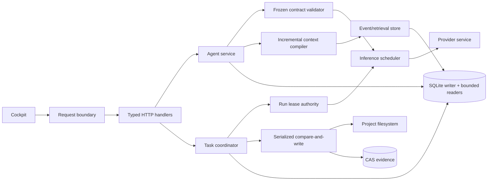

# Hermetrix Correctness, Durability, and Performance Remediation Specification

Master project specification: [2026-09-19-hermetrix-master-project-specification.md](2026-09-19-hermetrix-master-project-specification.md)

Date: 2026-09-18
Status: Proposed
Target: post-schema-v36
Source review: [`../reviews/2026-09-18-project-review.md`](../reviews/2026-09-18-project-review.md)
Reproduction evidence: [`../reviews/2026-09-18-probes.md`](../reviews/2026-09-18-probes.md)

## 1. Purpose

เอกสารนี้กำหนดการแก้ไข findings R01–R16 จาก project review ให้เป็นข้อกำหนดที่ทีมสามารถ implement, review, test และ rollout ได้โดยไม่ต้องตีความใหม่ระหว่างทำงาน เป้าหมายหลักคือทำให้ authority, state, filesystem, provider completion และ audit evidence ตรงกับสิ่งที่เกิดขึ้นจริงก่อนเพิ่ม concurrency หรือปรับ performance

สเปกนี้ถือ runtime และ persisted evidence เป็น source of truth เอกสารเดิมที่ขัดกับ implementation ต้องแก้ใน pull request เดียวกับ behavior change

## 2. Decision summary

ระบบ SHALL คงสถาปัตยกรรม local-first Go monolith, SQLite, content-addressed blob store และ browser-based cockpit ในรอบนี้ ไม่ย้ายไป distributed database, microservices หรือ frontend framework ใหม่

การแก้แบ่งเป็นหก workstreams ตาม dependency:

1. Request and authority correctness
2. Filesystem and operating-system correctness
3. Provider scheduling and budget accounting
4. Context, retrieval, and persistence efficiency
5. UI resilience and responsiveness
6. Release evidence, recovery, and documentation truth

ลำดับบังคับคือ workstream 1–2 ต้องผ่านก่อนเพิ่ม inference concurrency ใน workstream 3 ส่วน database pool/index ใน workstream 4 ทำได้เมื่อ measurement gate ยืนยัน bottleneck เท่านั้น

## 3. Scope

### 3.1 In scope

- HTTP trust boundary ของ local และ network control API
- frozen session contract ทุกเส้นทาง sampling รวม approval resume และ MCP sampling
- provider stream completion semantics และ partial-output evidence
- durable run lease, effect planning, dispatch, observation และ reconciliation
- optimistic filesystem writes, multi-file proposal apply และ rollback
- Windows command environment, process lifetime และ credential storage
- token/time budgets และ inference scheduling ทุก provider path
- long-session history, semantic/lexical retrieval, context snapshots และ SQLite access
- cockpit bootstrap, streaming, approvals และ long-transcript behavior
- direct artifact binding, backup consistency, metrics, benchmarks และ native CI

### 3.2 Out of scope

- multi-user accounts, OAuth หรือ full RBAC
- remote multi-node workers และ distributed leases
- replacing SQLite or CAS
- automatic retry of uncertain model/tool/file effects
- Windows kernel sandbox equivalent to Linux namespace isolation
- full disaster-recovery import of historical approvals as active authority
- UI framework rewrite
- model-quality improvements unrelated to retrieval, budget, or scheduling correctness

### 3.3 Operating assumptions

- one Hermetrix process owns one data root at a time; multi-process ownership is rejected explicitly until interprocess locking is designed
- one local user may run several sessions and up to four team tasks concurrently
- remote providers may run concurrently when they do not share a configured rate/resource key
- local runtime concurrency defaults to one until qualification supplies a higher safe value
- target release architecture is amd64 on Windows, Linux, and macOS; 32-bit builds are unsupported for release validation
- no accepted production SLO exists yet; proposed targets in section 16 become binding only after the baseline phase records the reference host and workload

## 4. Terms and invariants

### 4.1 Terms

- **authority-consuming transition**: an operation that creates or dispatches an effect, changes source files, starts a command, calls a provider, or resumes an agent loop
- **observation transition**: recording the outcome of an operation already dispatched; observation MUST remain possible after authority expires so the system can represent reality
- **frozen contract**: exact provider revision, model, policy, qualification, context profile, tool bindings, skill bindings and budget stored on the session
- **complete provider response**: protocol-valid response with a terminal reason and structurally complete tool calls
- **partial provider response**: bytes received without a valid terminal response
- **compare-and-write**: a write that succeeds only when the target still matches the caller's expected preimage at the instant of replacement
- **resource key**: scheduler key identifying a shared constrained inference resource
- **actual usage**: usage reported by the provider for the exact request
- **estimated usage**: bounded local prediction used when actual usage is unavailable

### 4.2 Non-negotiable invariants

| ID | Invariant |
|---|---|
| INV-01 | Cross-site browser requests MUST NOT mutate the control API. |
| INV-02 | One expected file preimage permits at most one successful replacement in one Hermetrix process. |
| INV-03 | A stale or expired run owner MUST NOT plan or dispatch a new effect. |
| INV-04 | Expired authority MUST NOT prevent recording or reconciling an already-dispatched effect. |
| INV-05 | Every provider call MUST match the frozen contract or an explicit immutable task/provider binding. |
| INV-06 | A partial provider response MUST NOT complete a turn or execute a partial tool call. |
| INV-07 | User approval is one-shot and scoped to the exact stored effect; contract drift MUST NOT widen it. |
| INV-08 | Every file mutation MUST produce either a durable receipt or an explicit `mutation_committed_receipt_failed` state. |
| INV-09 | Missing provider usage MUST be represented as estimated/unknown, never silently as zero. |
| INV-10 | Optional retrieval failure MUST NOT block the answer longer than its declared budget. |
| INV-11 | Optimization MUST preserve the append-only canonical event record and exact audit reconstruction. |
| INV-12 | No release claim is valid when its target OS/browser test was skipped. |

## 5. Target architecture



Architecture responsibilities:

- request boundary validates browser provenance and media type before routing
- frozen contract validator is the only precondition for session-owned sampling
- lease authority is checked transactionally at every new durable effect transition
- inference scheduler owns concurrency, fairness, queue timing and reservations
- canonical events remain append-only; derived retrieval/context state is rebuildable
- filesystem writes use one service-level serialization primitive shared by editor, tools, proposal apply and rollback
- proposal rows store exact artifact IDs; workflows never find authority evidence by scanning a capped recent list

## 6. HTTP request boundary specification

Addresses R01.

### 6.1 Host validation

SEC-001. The server SHALL derive an allowed host set at startup from the bound listener and explicit configuration.

SEC-002. For loopback listeners, the default allowed names SHALL include the exact bound IP, `localhost`, IPv4 loopback and IPv6 loopback with the active port. Arbitrary hostnames resolving to loopback SHALL NOT be trusted implicitly.

SEC-003. A request whose `Host` is outside the allowed set SHALL receive `421 Misdirected Request` before authentication, body decoding, or route execution.

SEC-004. Deployment behind a reverse proxy SHALL require explicit `--trusted-host` values. `X-Forwarded-Host` SHALL be ignored unless a separate trusted-proxy configuration exists; trusted-proxy support is out of scope for this release.

### 6.2 Browser provenance

SEC-005. Every state-changing method (`POST`, `PUT`, `PATCH`, `DELETE`) SHALL apply these checks:

1. If `Sec-Fetch-Site` equals `cross-site`, reject with `403`.
2. If `Origin` exists, its scheme, hostname and effective port MUST equal the request's externally accepted origin.
3. If `Origin` is absent and an authenticated bearer token is present, allow the non-browser client path.
4. If `Origin` is absent and the request is cookie-authenticated, require `Sec-Fetch-Site` to be `same-origin` or `none`.
5. If authentication is disabled, browser mutations still require same-origin provenance. A non-browser client without `Origin` remains allowed only when Host is valid and media type is correct.

SEC-006. Read-only `GET` and `HEAD` requests SHALL still enforce Host validation. They MAY omit Origin enforcement.

SEC-007. CORS headers SHALL NOT be added. Hermetrix does not expose a cross-origin browser API in this scope.

### 6.3 Body decoding

SEC-008. JSON handlers SHALL accept `Content-Type: application/json` and structured suffix `application/*+json`; parameters such as `charset=utf-8` are allowed.

SEC-009. Missing or incompatible JSON media types SHALL return `415 Unsupported Media Type` before reading the body.

SEC-010. `decodeJSON` SHALL reject a second non-whitespace JSON value. One request equals one JSON document.

SEC-011. The existing 10 MiB generic body limit remains the maximum; endpoints with lower business limits SHALL keep their lower bound.

SEC-012. Error bodies SHALL use a stable envelope:

```json
{
  "error": {
    "code": "cross_site_request",
    "message": "cross-site mutations are not allowed",
    "request_id": "request_..."
  }
}
```

Compatibility: during one release, clients MAY receive the existing string form from unchanged handlers, but every new boundary error MUST use the typed envelope. UI error parsing SHALL support both until migration completes.

### 6.4 Security tests

- untrusted Host on GET and POST
- same host with wrong port
- cross-site `Origin`, `Sec-Fetch-Site: cross-site`, and `text/plain`
- missing Origin with bearer auth
- missing Origin with cookie auth and missing fetch metadata
- same-origin cookie flow in a real browser
- loopback IPv4/IPv6 and configured network host
- two concatenated JSON documents
- oversized body and malformed media type

## 7. Frozen contract and provider completion specification

Addresses R04, R05 and parts of R08.

### 7.1 Shared contract validator

AGT-001. Introduce one package-level operation `ValidateSamplingContract` used immediately before every session-owned provider dispatch.

The validator SHALL compare:

- provider ID and current provider revision
- model
- policy revision
- session contract revision and cache epoch
- context profile against current declaration
- qualification run/revision and override expiry
- enabled state and credential readiness

AGT-002. `RunTurn`, `DecideApproval` continuation, MCP sampling, team-child continuation and any future resume path SHALL call the same validator. No caller may copy only a subset of checks.

AGT-003. Approval decision persistence and continuation are separate phases:

1. claim decision atomically
2. execute or deny the exact approved effect
3. persist its receipt
4. validate frozen sampling contract
5. resume model loop only if validation passes

If step 4 fails, the approval remains resolved and the effect receipt remains final. The turn transitions to `continuation_blocked` with reason `contract_drift`; it MUST NOT replay the effect or silently select a new provider.

AGT-004. UI SHALL display: “Approval resolved; the model configuration changed. Start a new session to continue.” The existing session remains readable and may be closed/exported.

AGT-005. A task-owned provider call SHALL validate its immutable `provider_id` + `provider_revision` binding before dispatch. Task workflows do not inherit a chat session contract unless explicitly bound to that session.

### 7.2 Complete response semantics

PRV-001. Provider adapters SHALL return one of:

- `CompletionComplete`
- `CompletionIncomplete`
- transport/protocol error

PRV-002. OpenAI-compatible SSE is complete only when all conditions hold:

- at least one valid choice was received
- a supported non-empty `finish_reason` was observed for the selected choice
- accumulated tool calls have non-empty ID/name as required and arguments decode as exactly one JSON object when dispatched
- the scanner reached a legal terminal boundary; `[DONE]` is accepted but not required when a terminal finish reason arrived and the HTTP body closed cleanly
- no response-size sentinel was exceeded

PRV-003. EOF without `finish_reason`, empty stream, malformed SSE, partial tool arguments, scanner token overflow and body-size overflow SHALL produce `CompletionIncomplete` or typed error. They MUST NOT return a normal completion.

PRV-004. For JSON completion responses, exactly one JSON value, a choice and a non-empty supported finish reason are required.

PRV-005. Partial content MAY be emitted while streaming for responsiveness, but it SHALL remain visually marked “streaming”. When the final state is incomplete:

- persist an event kind `provider_incomplete`
- persist bounded partial text as untrusted evidence
- do not persist it as the assistant's completed answer
- do not execute accumulated tool calls
- emit NDJSON `failed` with code `provider_stream_incomplete`

PRV-006. Automatic retry is prohibited after any response bytes or tool-call deltas have been received. A retry before any response bytes is allowed only where an existing provider contract explicitly declares it safe; no such retry is added by this spec.

PRV-007. Anthropic and Gemini adapters SHALL receive equivalent terminal-state tests using their native protocol semantics. Shared completion validation SHALL not erase adapter-specific stop reasons.

### 7.3 Usage quality

PRV-008. Each completion SHALL report usage quality:

```go
type UsageQuality string

const (
    UsageActual    UsageQuality = "actual"
    UsageEstimated UsageQuality = "estimated"
    UsageUnknown   UsageQuality = "unknown"
)
```

PRV-009. Zero usage fields are not evidence of zero consumption. When the provider omits usage, the caller records predicted prompt and maximum possible output as a conservative reservation, then stores `estimated` usage based on observed output plus estimator bounds.

PRV-010. Provider usage reconciliation SHALL never reduce a session below already committed actual usage. Negative or internally inconsistent provider usage is recorded as protocol evidence and replaced with a conservative estimate.

## 8. Durable lease and effect authority specification

Addresses R03.

### 8.1 Authority token

DUR-001. Every authority-consuming task operation SHALL accept a `RunAuthority` value:

```go
type RunAuthority struct {
    RunID      string `json:"run_id"`
    LeaseToken string `json:"lease_token"`
}
```

DUR-002. The raw lease token SHALL not enter logs, artifacts, error messages or metrics. HTTP responses may return it only from run creation/renewal endpoints over the existing authenticated/local channel.

DUR-003. `PlanEffect` and `DispatchEffect` signatures SHALL require `RunAuthority`. Coordinator endpoints that select files, propose, apply, verify or review MUST bind to the attempt's run and supply authority when the operation creates or dispatches a new effect.

### 8.2 Transactional checks

DUR-004. Planning an effect SHALL be one transaction that verifies:

- attempt exists and is `running`
- attempt belongs to `authority.run_id`
- run is `running`
- supplied lease token equals the run token
- `lease_expires_at > now`
- task is `running`
- attempt's step and plan revisions remain active
- requested action exists in the immutable step effect scope

Only after all predicates hold may the effect row be inserted.

DUR-005. Dispatching an effect SHALL perform the same live-owner checks in the same transaction as `planned → dispatched`.

DUR-006. The effect row SHALL add `run_id` and `lease_generation`. `lease_generation` increments only when ownership is explicitly replaced by a future takeover operation, not on normal renewal. Current release has no takeover API; initial value is 1.

DUR-007. Renewal extends expiry only for the same token/generation and active run. It does not revive an expired run. Recovery or a new explicit run is required.

### 8.3 Observation after expiry

DUR-008. `ObserveEffect` SHALL require only `operation_id` and a valid receipt for an already `dispatched` effect. It MUST NOT require a live lease.

DUR-009. `ReconcileEffect` SHALL require the existing operation ID and an adapter-supported receipt/error. It MUST NOT dispatch a new external action.

DUR-010. `CompleteAttempt` SHALL require live authority and SHALL fail while any effect is `planned`, `dispatched` or `uncertain`.

DUR-011. When the lease expires during an external call:

- the call context is cancelled where safe
- if dispatch definitely did not occur, mark `abandoned`
- if dispatch may have occurred, mark `uncertain`
- a late durable receipt may transition `dispatched/uncertain` to `observed/reconciled`
- the attempt cannot start another effect until a new run begins after reconciliation

### 8.4 Persistence migration

Proposed schema v37:

```sql
ALTER TABLE task_runs
  ADD COLUMN lease_generation INTEGER NOT NULL DEFAULT 1;

ALTER TABLE task_effect_intents
  ADD COLUMN run_id TEXT;

ALTER TABLE task_effect_intents
  ADD COLUMN lease_generation INTEGER;
```

The statements above describe the temporary migration shape, not the final constraint state. Migration SHALL:

1. add nullable staging columns
2. backfill `run_id` by joining `task_step_attempts.run_id` and set `lease_generation=1`
3. abort if any row has no matching attempt/run
4. rebuild `task_effect_intents` inside one transaction so `run_id` and `lease_generation` are `NOT NULL` and `run_id` has `FOREIGN KEY(run_id) REFERENCES task_runs(id) ON DELETE CASCADE`
5. recreate `idx_task_effects_reconcile` and create `idx_task_effects_run_state(run_id,state,updated_at)`
6. run `PRAGMA foreign_key_check` before committing

The table rebuild SHALL preserve IDs, operation IDs, receipts, timestamps and the original attempt/task foreign keys. Rows that cannot be backfilled make migration fail; they are never assigned empty or orphan authority.

### 8.5 Concurrency tests

- expiry between PlanEffect predicate read and insert
- expiry between DispatchEffect predicate read and update
- renewal racing with dispatch
- two callers dispatching the same operation
- recovery racing with late receipt
- stale token with correct run ID
- correct token with wrong run ID
- expired owner cannot plan or dispatch; late observation succeeds

Tests SHALL use barriers/channels around transaction boundaries rather than `time.Sleep`.

## 9. Filesystem consistency and proposal recovery specification

Addresses R02 and R14.

### 9.1 Process ownership

FS-001. `store.Open` SHALL acquire an exclusive data-root process lock before migrations. A second Hermetrix process targeting the same data root SHALL fail startup with a clear error. This makes in-process path locking an honest guarantee.

FS-002. The lock SHALL be held until Store close and SHALL use native advisory/file locking appropriate to the OS. A stale lock file alone is not sufficient evidence of a live process; ownership must come from the OS lock.

### 9.2 Path lock manager

FS-003. Product service SHALL own a keyed lock manager keyed by:

```text
canonical-project-root + NUL + normalized-relative-path
```

Windows keys SHALL be case-folded according to filesystem semantics. Symlink and parent resolution SHALL occur before lock-key construction and SHALL be revalidated while the lock is held.

FS-004. The lock covers the complete compare-and-write sequence:

1. resolve and validate parent/target
2. read `Lstat` and content
3. compare expected preimage
4. create a durable file-mutation intent with before/after hashes
5. create and fsync temp file
6. transition the intent to `dispatched`
7. replace target atomically
8. fsync containing directory where the OS supports it
9. create mutation receipt and transition the intent to `observed`
10. release lock

FS-005. Lock entries SHALL use reference counting and be removed after the last waiter exits. Cancellation while waiting MUST remove the waiter and MUST NOT leak the lock entry.

FS-006. Different canonical paths may write concurrently. The same canonical path is serialized across editor, `workspace.write_file`, proposal apply, verification rollback and future import paths.

### 9.3 Expected preimages

FS-007. New-file creation SHALL use the explicit sentinel `absent`; an empty expected hash is invalid for mutation APIs after one compatibility release.

FS-008. Existing-file replacement requires a lowercase 64-character SHA-256 expected hash.

FS-009. Conflict returns HTTP `409` / typed `ErrPreimageChanged` with current hash metadata but no file body.

FS-010. A same-preimage concurrency test with 50 writers MUST produce exactly one success. Creation of the same absent path by 50 writers MUST also produce exactly one success.

FS-011. This guarantee covers cooperating Hermetrix writes within the owning process. An external editor may change a file outside the lock; therefore the implementation SHALL perform the final preimage check immediately before replacement and document that platform primitives cannot supply cross-process CAS without stronger locking.

### 9.4 Receipt failure semantics

FS-012. Every write path SHALL create a durable `file_mutation_intent` before replacing the target. If filesystem replacement succeeds but receipt persistence fails, the pre-existing intent remains `dispatched` and the API SHALL return a typed `MutationCommittedReceiptFailed` result carrying:

- resulting document hash
- operation ID
- path
- receipt error code

The result MUST NOT be indistinguishable from “write did not occur”. Startup recovery reconciles the intent using the current file hash: matching `after_sha256` creates the missing receipt and marks it `reconciled`; matching `before_sha256` marks it `abandoned`; any other hash marks it `uncertain`. Recovery never rewrites the file and the intent contains hashes/metadata, never the secret/content body.

The intent table is introduced with schema v38:

```sql
CREATE TABLE file_mutation_intents (
  id TEXT PRIMARY KEY,
  operation_id TEXT NOT NULL UNIQUE,
  project_id TEXT NOT NULL,
  path TEXT NOT NULL,
  actor TEXT NOT NULL,
  before_sha256 TEXT NOT NULL,
  after_sha256 TEXT NOT NULL,
  state TEXT NOT NULL,
  receipt_artifact_id TEXT,
  error TEXT NOT NULL DEFAULT '',
  created_at TEXT NOT NULL,
  updated_at TEXT NOT NULL,
  FOREIGN KEY(project_id) REFERENCES projects(id) ON DELETE CASCADE,
  FOREIGN KEY(receipt_artifact_id) REFERENCES artifacts(id) ON DELETE RESTRICT
);

CREATE INDEX idx_file_mutation_recovery
  ON file_mutation_intents(state, updated_at);
```

### 9.5 Proposal artifact binding

FS-013. `task_code_proposals` SHALL persist direct nullable foreign keys:

- `rollback_artifact_id`
- `verification_artifact_id`

FS-014. Apply creates the rollback artifact before transitioning to `applying`, then stores its ID atomically with that transition.

FS-015. Verification stores its bundle ID atomically with `applied → awaiting_post_review`.

FS-016. Review and rollback MUST load artifacts by these IDs. They SHALL NOT scan `ListArtifacts`, recent limits or metadata JSON to rediscover authority evidence.

FS-017. Add `ProposalRecoveryRequired = "recovery_required"`. It is an operator-visible terminal hold state: no apply, verification, review, completion or automatic rollback may start from it. Recovery may transition it only to its exact pre-migration state after an operator or deterministic repair binds one unique artifact and records an audit event. Deleting/recreating a proposal to bypass this state is prohibited.

Proposed schema v38:

```sql
ALTER TABLE task_code_proposals
  ADD COLUMN rollback_artifact_id TEXT REFERENCES artifacts(id) ON DELETE RESTRICT;

ALTER TABLE task_code_proposals
  ADD COLUMN verification_artifact_id TEXT REFERENCES artifacts(id) ON DELETE RESTRICT;
```

Existing in-progress proposals SHALL be backfilled by exact `proposal_id` metadata query without the 500-item limit. Zero or multiple matching artifacts moves the proposal to `recovery_required`; migration does not guess. The migration SHALL persist the former state in a bounded recovery audit artifact so an explicit repair can restore only that state.

### 9.6 Multi-file apply/rollback

FS-018. Multi-file apply acquires all canonical path locks in sorted order before validating any preimage, preventing deadlock and partial apply caused by another Hermetrix writer.

FS-019. All preimages are revalidated under locks before the first mutation.

FS-020. Rollback occurs in reverse write order under the same held locks. The result records each path as `restored`, `unchanged`, `conflict` or `failed`.

FS-021. Cancellation after first mutation does not abandon rollback. A bounded cleanup context of 30 seconds is used; if cleanup does not finish, the effect becomes `uncertain` with per-file receipts.

FS-022. `rollback_complete` is emitted only when every mutated path is restored to its exact preimage hash.

## 10. Windows command, process, and credential specification

Addresses R06, R07 and part of R15.

### 10.1 Child environment

OS-001. Environment construction SHALL be split by build tag into common and OS-specific functions.

OS-002. Every command job SHALL receive a newly created per-job temporary directory inside the Hermetrix data root, for example:

```text
<data-root>/runtime/jobs/<job-id>/tmp
```

Windows receives `TEMP` and `TMP`; POSIX receives `TMPDIR`. Go commands receive explicit `GOCACHE` and may receive existing `GOMODCACHE`/`GOPATH` according to sandbox policy.

OS-003. Windows safe baseline includes only values proven necessary:

- `PATH`
- `SystemRoot`
- `COMSPEC` only when an allowlisted executable demonstrably requires it; commands still run without a shell
- `PATHEXT`
- `TEMP`, `TMP`
- `USERPROFILE` only when a tool cannot be configured with explicit cache paths
- explicit `GOCACHE`, `GOMODCACHE`, `GOPATH`, `GOROOT`

No environment name matching credential markers is inherited. Tests SHALL plant representative `*_TOKEN`, `*_KEY`, `*_SECRET` values and verify they are absent in the child.

OS-004. Temp directories are removed after artifact/receipt persistence. Failed cleanup is logged as bounded metadata and handled by scheduled maintenance.

### 10.2 Windows process lifetime

OS-005. Windows commands SHALL be created suspended, assigned to a Job Object configured with `KILL_ON_JOB_CLOSE`, then resumed. The child must not execute user code before assignment.

OS-006. If Job Object creation/assignment fails, command launch SHALL fail closed when strict process containment is required. In normal mode the failure may fall back only if the receipt explicitly states `process-hardening-only` and the root process has not started executing.

OS-007. MCP stdio launchers SHALL use the same Windows process-lifetime primitive.

OS-008. MCP launcher configuration SHALL migrate from one shell-like command string to structured executable + argument array. Existing strings are parsed once for compatibility, surfaced for review and saved in structured form; quoting is never delegated to a shell.

### 10.3 Windows credential protection

OS-009. POSIX retains owner-only file storage with mode verification.

OS-010. Windows vault values SHALL be protected with DPAPI CurrentUser before writing to disk. The vault file SHALL contain versioned encrypted records, not plaintext JSON tokens.

Example envelope:

```json
{
  "format": 2,
  "protection": "windows-dpapi-current-user",
  "values": {
    "provider:...": "base64-ciphertext"
  }
}
```

OS-011. First successful Windows open of format 1 performs an atomic migration:

1. read existing values
2. encrypt all non-empty values
3. write and sync a temp format-2 file
4. replace the old file
5. verify it can be decrypted

Failure leaves the original file unchanged and returns an error; it does not start with an empty vault.

OS-012. `Vault.Set` SHALL use copy-on-write memory semantics: construct and persist a new map first, then swap the in-memory map after persistence succeeds. Failed persistence must not change effective credentials until restart.

OS-013. Native Windows tests SHALL prove a second test account cannot decrypt/read effective secrets. File mode assertions alone are not accepted as the confidentiality gate.

### 10.4 Platform capability contract

OS-014. `/api/capabilities` SHALL expose supported runtime features including interactive terminal, managed browser, command sandbox, process-tree containment and credential protection.

OS-015. Handler validation order SHALL follow the operation's real preconditions. If an operation requires a project root, a codeless project returns the existing domain-specific `422` before platform dispatch. Once those platform-independent preconditions pass, an unsupported OS capability returns stable `501 Not Implemented` and does not start background work. Operations that do not require a project root may return `501` immediately after request validation.

## 11. Inference scheduler and budget specification

Addresses R08 and R09.

### 11.1 One dispatch path

SCH-001. Every model request SHALL flow through `InferenceScheduler.Do`; direct production calls from agent, MCP sampling, learning reviewer, qualification, planner, selector, proposer, reviewer and team execution are prohibited.

SCH-002. Provider service remains responsible for protocol/credentials. Scheduler owns admission, queueing, resource concurrency, reservations, cancellation and metrics.

### 11.2 Resource keys and limits

SCH-003. Resource key defaults:

```text
local:<adapter>:<normalized-base-url>
remote:<provider-id>
```

Profiles MAY declare the same explicit `resource_group` to share a quota. Secrets never enter the key.

SCH-004. Default concurrency:

- local resource: 1
- remote provider profile: 4
- qualification workload: 1 per resource and lower priority than foreground
- global safety ceiling: 8 provider calls process-wide

Configuration may lower these values. Raising local concurrency above 1 requires qualification evidence for the exact runtime/model/resource group.

SCH-005. Priorities are `foreground`, `approval_continuation`, `task`, `qualification`, `background`. Foreground and approval continuation share the highest class; FIFO ordering applies within a class.

SCH-006. Background work is cooperative: when foreground waits for the same resource, queued background work yields. A request already dispatched is cancelled only if its workflow declares cancellation safe; otherwise it completes and foreground waits.

SCH-007. Waiting for a tool, browser, command or user approval SHALL NOT hold an inference slot.

### 11.3 Request-scoped MCP ownership

SCH-008. Global mutable `mcpBridge.currentSession` SHALL be removed before remote concurrency increases.

SCH-009. MCP server-request handlers receive immutable call context containing session ID, turn ID, tool-call ID, server ID and remaining sampling budget. Ownership is bound to the stdio/HTTP call instance, not “whichever session is current”.

SCH-010. Per-tool-call sampling count is stored in this context. Concurrent MCP calls cannot reset or consume each other's budget.

### 11.4 Budget reservation and reconciliation

SCH-011. Before dispatch, scheduler reserves:

```text
predicted_prompt_upper_bound + requested_max_output
```

against the owning task/session budget. If insufficient budget remains, no request is sent.

SCH-012. After completion, reservation is reconciled with actual usage. When usage is estimated, the conservative estimate is charged. Unused reservation is released.

SCH-013. Nested MCP sampling and model reviewer calls charge the initiating owner and identify a `usage_source`.

SCH-014. Wall-time accounting stores active execution time and absolute request deadlines. Time spent awaiting explicit human approval is excluded; queue wait, provider time, tool execution and automatic retries allowed by contract are included.

SCH-015. Resume after approval receives only the remaining model steps, tool calls, active time and token budget persisted before pause.

Durable accounting is introduced in schema v40:

```sql
CREATE TABLE inference_usage_ledger (
  id TEXT PRIMARY KEY,
  request_id TEXT NOT NULL UNIQUE,
  owner_kind TEXT NOT NULL,
  owner_id TEXT NOT NULL,
  session_id TEXT,
  turn_id TEXT,
  usage_source TEXT NOT NULL,
  resource_key_hash TEXT NOT NULL,
  reserved_prompt_tokens INTEGER NOT NULL,
  reserved_output_tokens INTEGER NOT NULL,
  charged_prompt_tokens INTEGER NOT NULL DEFAULT 0,
  charged_output_tokens INTEGER NOT NULL DEFAULT 0,
  usage_quality TEXT NOT NULL,
  state TEXT NOT NULL,
  active_started_at TEXT,
  active_elapsed_ms INTEGER NOT NULL DEFAULT 0,
  deadline_at TEXT NOT NULL,
  terminal_reason TEXT NOT NULL DEFAULT '',
  created_at TEXT NOT NULL,
  updated_at TEXT NOT NULL
);

CREATE INDEX idx_inference_usage_owner
  ON inference_usage_ledger(owner_kind, owner_id, created_at);
```

Allowed states are `reserved`, `dispatched`, `reconciled`, `cancelled_before_dispatch` and `uncertain`. Reservation insertion and owner-budget decrement SHALL occur in one transaction. Reconciliation SHALL be idempotent by `request_id`; a crash after provider dispatch leaves `uncertain` and reserves the conservative upper bound until explicit reconciliation. Raw resource keys and prompt content are not persisted.

### 11.5 Scheduler metrics

Each request records bounded metadata:

- request ID and owner kind/ID
- resource key hash
- priority
- queue duration
- provider duration and time to first token
- reserved/actual/estimated tokens
- usage quality
- cancellation/terminal reason

Prompt text, tool arguments, credentials and raw response content SHALL NOT enter scheduler metrics.

## 12. Context, retrieval, and persistence specification

Addresses R10–R12.

### 12.1 Canonical and derived data

CTX-001. `agent_events` remains the canonical append-only history.

CTX-002. Retrieval indexes, checkpoints, cached query vectors and context manifests are derived data. They MUST carry a revision and be rebuildable without changing canonical events.

CTX-003. Deleting a session deletes its derived data through foreign keys or explicit cleanup. A failed derived-data update does not fail a completed turn unless the active request cannot be reconstructed safely.

### 12.2 Paginated event access

CTX-004. Replace unbounded UI `ListEvents` with cursor pagination:

```text
GET /api/sessions/{id}/events?after_sequence=<n>&limit=<1..200>
GET /api/sessions/{id}/events?before_sequence=<n>&limit=<1..200>
```

Response:

```json
{
  "items": [],
  "oldest_sequence": 1,
  "newest_sequence": 200,
  "has_older": true,
  "has_newer": false
}
```

CTX-005. Internal compilation may read a bounded recent window plus the latest validated checkpoint and explicitly retrieved older events. It SHALL not drop canonical events.

### 12.3 Incremental context checkpoint

CTX-006. Add `session_context_checkpoints` derived table:

```sql
CREATE TABLE session_context_checkpoints (
  id TEXT PRIMARY KEY,
  session_id TEXT NOT NULL,
  source_through_sequence INTEGER NOT NULL,
  contract_revision TEXT NOT NULL,
  compiler_revision TEXT NOT NULL,
  estimator_revision TEXT NOT NULL,
  checkpoint_blob_ref TEXT NOT NULL,
  manifest_hash TEXT NOT NULL,
  created_at TEXT NOT NULL,
  UNIQUE(session_id, source_through_sequence,
         contract_revision, compiler_revision, estimator_revision),
  FOREIGN KEY(session_id) REFERENCES agent_sessions(id) ON DELETE CASCADE
);
```

CTX-007. A checkpoint is valid only if all revision fields match and canonical event sequence is contiguous through the recorded boundary.

CTX-008. Each model step compiles from:

- stable identity/policy/skill/tool fragments
- latest valid checkpoint
- canonical events after its sequence
- causally paired events required by active tool/approval flows
- explicit older retrieval results referenced by event ID

CTX-009. Checkpoint creation preserves causal pairs and verified-compactor provenance. It may happen after the response on a bounded background queue so it does not increase time to first token.

### 12.4 Snapshot deduplication

CTX-010. Existing `context_snapshots.compiled_json` remains readable for historical rows. New snapshots store a content-addressed compiled payload in CAS and persist a manifest/reference, report and hash in SQLite. Because the existing column is `NOT NULL`, new CAS-backed rows write the literal empty JSON object `{}` to `compiled_json`; an empty string is invalid. Readers prefer a non-empty `compiled_blob_ref`, otherwise they decode the historical inline value.

Proposed schema v39:

```sql
ALTER TABLE context_snapshots
  ADD COLUMN compiled_blob_ref TEXT NOT NULL DEFAULT '';

ALTER TABLE context_snapshots
  ADD COLUMN manifest_hash TEXT NOT NULL DEFAULT '';
```

CTX-011. A new snapshot writes CAS first, then snapshot/binding/event rows in one transaction. If the transaction fails, unreferenced CAS is later collected by existing GC.

CTX-012. Reconstruction verifies blob checksum, manifest hash and referenced event existence. Historical inline snapshots remain valid.

### 12.5 Lexical retrieval

CTX-013. Phase one optimization SHALL precompute reusable normalized lexical features per event at append time. The implementation may choose a compact blob or an SQLite index only after a benchmark compares size, latency and Thai/identifier recall.

The mandatory behavior is:

- exact substring and identifier matches remain strongest
- Thai/unspaced-script matching remains supported
- user/assistant/tool causal information remains searchable
- index revision identifies normalization/gram rules
- missing/stale index falls back to bounded canonical scanning and schedules rebuild

CTX-014. Candidate generation MUST avoid constructing complete word/trigram maps for every event on every query.

CTX-015. Search reads only the content of ranked candidates needed for excerpts. Metadata SHALL report canonical events considered, indexed candidates scored, fallback usage and index revision.

### 12.6 Semantic retrieval

CTX-016. Embedding revision SHALL be a digest of normalized endpoint identity, model, dimensions, chunking revision and normalization revision. Credential values are excluded.

CTX-017. Query embeddings SHALL be cached in memory by `(revision, text hash)` with a bounded LRU and TTL. Cached values never cross revisions.

CTX-018. New-event indexing uses a durable outbox or deterministic missing-row query, batches up to the existing safe limit and performs one semantic search after updates. It MUST NOT run search → embed → search when no new rows exist.

CTX-019. Semantic retrieval has a separate deadline, initially 2 seconds foreground and 10 seconds background indexing. Timeout/failure returns lexical results and records a metric; it does not fail the turn.

CTX-020. `fragmentRelevance` reuses the query vector and loaded per-event best scores within one model step. It must not invoke the embedding endpoint again for the same focus/revision.

### 12.7 SQLite measurement gate

CTX-021. Before changing `SetMaxOpenConns(1)`, instrument:

- `DB.Stats().WaitCount` and `WaitDuration`
- query duration by operation name
- transaction duration
- WAL size/checkpoint duration
- foreground latency under mixed read/write workload

CTX-022. A reader/writer split is implemented only if the reference workload shows DB queue wait contributes at least 10% of foreground pre-provider p95 or exceeds 50 ms p95.

CTX-023. If triggered, use one writer connection and a bounded read pool of at most 4 connections. Every connection MUST receive `foreign_keys=ON`, `busy_timeout=5000` and required pragmas. Tests verify pragmas per acquired connection.

CTX-024. SQLite still permits one writer. Write transactions stay short; event/receipt batches use one transaction where atomicity is required. No transaction remains open while calling providers, embeddings, commands or filesystem operations.

CTX-025. Replace 25 ms database polling for managed jobs with in-process completion notification plus bounded exponential polling fallback after restart. Poll intervals: 100 ms, 250 ms, 500 ms, then 1 second maximum.

## 13. UI behavior specification

Addresses R13.

### 13.1 Progressive bootstrap

UI-001. Initial readiness depends only on:

- authentication/session status
- projects
- selected project's sessions
- minimal capability/status summary

Optional data such as artifacts, backups, maintenance, qualifications, fidelity, teams and authority history loads per view or panel.

UI-002. Replace the global 21-request `Promise.all` with resource states:

```js
{ status: "idle|loading|ready|error", data: [], error: null, requestId: 0 }
```

UI-003. Failure of one optional resource shows an inline retry for that surface and does not clear previously loaded data or block project/chat rendering.

UI-004. Obsolete requests are cancelled with `AbortController` or ignored by monotonically increasing request IDs when the selected project/session changes.

### 13.2 Session timeline

UI-005. Session selection loads the newest 100 timeline events. Scrolling to the top loads older pages while preserving scroll position.

UI-006. The DOM keeps a bounded window by default, initially 500 rendered timeline items. Older loaded data remains in state and can be remounted; this limit is adjustable after browser profiling.

UI-007. Stream deltas accumulate in state by `session_id` + `turn_id`. DOM writes are coalesced at most once per animation frame.

UI-008. Automatic scroll occurs only if the user was already within 80 px of the bottom. Reading older messages is never interrupted by a new delta.

UI-009. Switching views or sessions during a stream cannot attach content to the wrong session. Returning to the active session reconstructs the partial display from state.

### 13.3 Completion and failure display

UI-010. Streaming, completed, approval-required, continuation-blocked and provider-incomplete are visually distinct states.

UI-011. Partial provider output may be expanded as diagnostic evidence but is never styled as the final assistant answer.

UI-012. Workspace chat and full Chat share the same turn state and approval model. The workspace pane SHALL show pending approvals and provide a link/action to review the full exact preview.

UI-013. Workspace excerpts keep the current compact display, but every truncated message offers an accessible “View full message” action.

### 13.4 UI modularization

UI-014. Do not rewrite the frontend framework. Extract modules only after behavior tests exist, starting with:

- API/resource loader
- chat/timeline state
- stream consumer
- project/workbench state
- durable task cockpit

UI-015. No module extraction PR may combine unrelated visual redesign. The acceptance criterion is unchanged behavior plus targeted reliability/performance improvement.

## 14. Artifact, backup, observability, and documentation specification

Addresses R14 and R16.

### 14.1 Artifact queries

OPS-001. Add typed repository queries for artifact ID, operation ID, proposal ID and kind. Authority workflows SHALL use exact IDs or unique indexed operation bindings.

OPS-002. Metadata JSON remains descriptive; it is not the only relational binding for approval, rollback or verification authority.

### 14.2 Skill export consistency

OPS-003. Existing backup remains a Skill portability export and SHALL be named as such in API/UI/documentation.

OPS-004. Export all allowlisted tables from one read transaction to obtain a consistent snapshot.

OPS-005. Every referenced blob MUST exist and match its checksum. A missing/corrupt blob fails export; it is not silently skipped.

OPS-006. Export envelope includes schema version, export kind, row counts, blob counts/bytes and payload checksum.

OPS-007. Import preview verifies the full envelope before creating candidates. It never activates imported approval/effect authority.

### 14.3 Full recovery

OPS-008. Full data-root recovery is a separate operational procedure covering SQLite + WAL state + CAS + vault strategy. This spec requires design and restore drill documentation, not automatic UI import.

OPS-009. A recovery drill SHALL restore a copied data root into an isolated location and verify:

- schema opens and foreign-key check passes
- every referenced CAS blob exists
- sessions/events/artifacts are readable
- credentials are either separately restored securely or explicitly absent
- no pending approval/effect is auto-executed

### 14.4 Observability

OPS-010. Introduce request IDs at the HTTP boundary and operation IDs for internal workflows. Logs correlate IDs without raw prompts, responses, file bodies or credentials.

OPS-011. Record bounded timings:

- HTTP handler duration/status
- DB wait/query/transaction
- scheduler queue/provider/TTFT
- context load/compile/freeze
- retrieval lexical/semantic/index update
- command queue/run/artifact persistence
- UI resource load and stream terminal state

OPS-012. High-cardinality raw IDs are logs, not metric labels. Metric labels are bounded enums such as operation, adapter, status and platform.

OPS-013. Add benchmark functions for history retrieval, context compile, snapshot persistence, concurrent writes and scheduler admission. CI records results as artifacts; performance regression thresholds run on a pinned nightly/reference job, not noisy pull-request hosts until variance is characterized.

### 14.5 Documentation truth

OPS-014. A behavior-changing PR updates README/HANDOVER/architecture claims in the same PR.

OPS-015. Generated doc-truth checks validate countable claims. Semantic claims such as “production”, “kernel closed”, OS support and UI completion require an explicit checklist linked to evidence.

## 15. Migration and compatibility plan

### 15.1 Schema sequence

| Version | Change | Rollback/read compatibility |
|---:|---|---|
| 37 | run lease generation + effect run binding | old binaries MUST NOT open upgraded DB; normal current migration policy applies |
| 38 | file-mutation intents + direct rollback/verification artifact IDs | old artifact rows retained; backfill in-progress proposals |
| 39 | context snapshot CAS reference + context checkpoints | old inline snapshots remain readable |
| 40 | retrieval index/outbox and mandatory inference usage ledger | retrieval tables rebuildable; reconciled usage rows remain audit evidence |

Each migration SHALL be idempotent under restart at the boundary already established by store migration tests. A migration touching real referenced rows requires an aged-database fixture with populated foreign keys.

### 15.2 API compatibility

- New typed error envelope is additive for one release; UI handles old/new
- task mutation endpoints add required `run_id`/`lease_token`; old clients receive `400 missing run authority`, never implicit authority
- `expected_sha256: ""` for new files is accepted only during one compatibility release and normalized to `absent` with a deprecation warning; after that it is rejected
- existing session detail endpoint may continue returning bounded recent events during transition, then moves to the paginated events endpoint
- MCP stored command strings remain readable and are migrated to structured fields when saved

### 15.3 Feature flags and rollout order

Temporary flags:

- `HERMETRIX_INFERENCE_SCHEDULER=1` — shadow metrics first, then enforcement
- `HERMETRIX_INCREMENTAL_CONTEXT=1` — dual-compile comparison before serving new output
- `HERMETRIX_READ_POOL=1` — available only after CTX-022 gate passes

Host/origin/media-type enforcement has no bypass flag. The remaining flags SHALL have removal issues and a maximum lifetime of two releases; they are rollout controls, not long-term user preferences.

Rollout order:

1. native CI + observability baseline
2. request boundary, provider completion, contract validation, lease authority
3. filesystem serialization, direct artifacts, Windows env/vault/process fixes
4. scheduler in shadow mode, then enforced with concurrency unchanged
5. incremental context/retrieval in dual-run comparison
6. reader pool only if measurement gate triggers
7. progressive UI and docs/recovery release gate

## 16. Performance and reliability targets

These are proposed release gates. Baseline work SHALL record hardware, OS, Go architecture, data shape and at least 30 measured iterations before accepting them.

| ID | Workload | Target |
|---|---|---|
| SLO-01 | lexical retrieval, 10k events × ~1 KiB, mixed Thai/English/identifiers | p95 ≤100 ms; allocations ≤25 MiB/op |
| SLO-02 | context preparation, standard 5k-event session with valid checkpoint | p95 ≤200 ms before scheduler queue/provider time |
| SLO-03 | four 250 ms fake remote calls, cap 4, distinct resource keys | elapsed ≤600 ms; no cross-session ownership |
| SLO-04 | same workload, one local resource key, cap 1 | max observed concurrency =1 |
| SLO-05 | 50 same-preimage writers | exactly 1 success; 49 typed conflicts; final hash matches receipt |
| SLO-06 | project/session critical UI bootstrap on reference host | p95 ≤1 s with optional APIs delayed 5 s |
| SLO-07 | 10k-event timeline | no long task >50 ms during normal scroll/stream on reference browser |
| SLO-08 | token-efficiency held-out corpus | ≥20% median token reduction with no statistically material task-success/fidelity loss |
| SLO-09 | mixed DB workload | zero busy errors; DB queue wait <10% of pre-provider p95 |
| SLO-10 | Windows plan→proposal→apply→verify→review | completes as non-admin with no secret env leakage |

If a target cannot be met without reducing correctness or fidelity, the implementation remains correct and the target is revised with measured evidence. Silent context truncation, skipped tests or weaker authority checks are forbidden optimizations.

## 17. Test and evidence matrix

| Area | Unit/invariant | Integration | Fault/concurrency | Outcome evidence |
|---|---|---|---|---|
| Request boundary | Host/origin/media predicates | real handler + auth modes | malformed/oversize/multiple JSON | browser same-origin works; cross-site fails without mutation |
| Contract | revision comparison table tests | approval pause/resume | model/policy/qualification drift at every boundary | resolved approval never replayed; continuation clearly blocked |
| Provider | terminal-state parsers | mock native adapters | EOF, abort, partial tool JSON, size limit | no incomplete assistant message marked final |
| Lease/effect | state transitions | SQLite real store | expiry/renew/recovery races | stale worker causes no new external action |
| Files | key normalization/CAS | real temp filesystem | 50 writers, cancellation, receipt DB failure | final disk and receipt agree |
| Proposal | exact artifact binding | 1,000 unrelated artifacts | partial apply/rollback/crash | review/rollback exact old proposal |
| Windows | env/vault helpers | native non-admin jobs/DPAPI | cancel process tree, failed vault replace | full task verification succeeds; second account cannot decrypt |
| Scheduler | queue/admission/reservation | fake providers/resources | cancel, starvation, nested MCP | foreground latency and concurrency match configured caps |
| Context | revision/checkpoint validity | aged 10k/100k event DB | stale/missing index/blob/embedding timeout | retrieval fidelity and audit reconstruction preserved |
| UI | resource state/stream reducer | real browser/API | delayed/failing APIs, switch during stream | project/chat usable and approvals visible |
| Backup | checksum/envelope | populated Skill export/import | missing blob, DB mutation during export | restored candidates match consistent source snapshot |

Mandatory commands for a release candidate:

```text
go test ./... -count=1
go test ./... -race -count=1
go vet ./...
golangci-lint run
node --test internal/web/ui/runtime.test.js
node --check internal/web/ui/runtime.js
node --check internal/web/ui/app.js
```

Additionally, native Windows/Linux/macOS jobs execute their supported workflow tests. Required browser E2E jobs set the existing require flag and fail when the browser is absent; a skip is not a pass.

## 18. Work packages and file boundaries

### WP-A — Baseline and release environments

Primary files:

- `.github/workflows/ci.yml`
- benchmark test files in `internal/agent`, `internal/context`, `internal/product`
- observability helpers under `internal/durability` or a narrowly named new package

Deliverables: amd64 toolchain, native OS matrix, skip report, reference workload/host record, timing metrics. No runtime concurrency change.

### WP-B — Request, contract, stream, lease

Primary files:

- `internal/web/server.go`, `internal/web/auth.go`
- `internal/agent/service.go`, `internal/agent/mcpbridge.go`
- `internal/providers/*.go`
- `internal/taskengine/execution.go`
- `internal/store/store.go`

Deliverables: SEC/AGT/PRV/DUR requirements and reversed permanent regression tests from the review probes.

### WP-C — Files, artifacts, Windows

Primary files:

- `internal/product/workbench.go`
- `internal/product/commands*.go`
- `internal/product/service.go`
- `internal/secrets/vault.go` plus OS-specific protectors
- `internal/taskcoord/service.go`
- `internal/taskengine/codeproposal.go`
- `internal/mcp/stdio_windows.go`

Deliverables: FS/OS requirements, direct artifact schema and native Windows workflow.

### WP-D — Scheduler and budgets

Primary files:

- new focused `internal/inference` package
- `internal/providers/service.go`
- all production `StreamChat` call sites
- agent/task/team/qualification/learning services

Deliverables: one dispatch path, request-scoped MCP context, reservations, metrics. Initial enforced limits preserve current local cap=1.

### WP-E — Context and storage performance

Primary files:

- `internal/agent/contextsearch.go`, `internal/agent/semantic.go`, `internal/agent/service.go`
- `internal/context/*`
- `internal/embedding/*`
- `internal/store/store.go`
- `internal/taskcoord/service.go`

Deliverables: pagination, derived index, checkpoint/CAS snapshots, semantic caching and conditional DB read pool.

### WP-F — UI, recovery and documentation truth

Primary files:

- `internal/web/ui/app.js`, `runtime.js`, tests
- `internal/web/server.go`
- `internal/product/backup.go`
- README, HANDOVER, ARCHITECTURE, capability documentation

Deliverables: progressive loading, reliable streaming state, browser journeys, consistent Skill export, recovery drill and truthful status docs.

## 19. Pull request policy

- One PR should close one causal boundary or one tightly connected migration; do not combine all workstreams.
- Every R01–R16 closure links requirement IDs, before evidence, focused test and real outcome evidence.
- A migration PR contains aged-database fixtures and restart/idempotency tests.
- A performance PR contains before/after benchmark commands, host details and raw summary; code size or green unit tests are not performance evidence.
- A Windows support PR runs on native Windows. Cross-compilation is supporting evidence only.
- New ignored errors require an explicit comment explaining why failure is best effort and how state remains truthful.
- No PR may make a failing path green by skipping tests, weakening assertions or translating a real failure into an unconditional skip.

## 20. Release exit criteria

The remediation release is `qualified` only when:

1. INV-01 through INV-12 have permanent regression tests.
2. All P1 requirements in sections 6–10 pass on their named targets.
3. Native Windows full task workflow passes as non-admin.
4. Required browser journeys pass with no skips.
5. Race suite passes on supported amd64 CI.
6. Scheduler owns every production provider dispatch.
7. Long-session retrieval/context workload meets accepted targets or carries an explicitly reviewed measured exception.
8. A 1,000-unrelated-artifact scenario still reviews and rolls back the bound proposal.
9. Skill export fails closed on missing/corrupt blobs and passes a restore-as-candidate drill.
10. README/HANDOVER/ARCHITECTURE describe actual supported behavior and limitations.

Production status requires additional packaging, signed distribution, upgrade/rollback operations and security review outside this remediation scope.

## 21. Traceability

| Review finding | Requirements |
|---|---|
| R01 | SEC-001–012 |
| R02 | FS-001–012 |
| R03 | DUR-001–011 |
| R04 | AGT-001–005 |
| R05 | PRV-001–007 |
| R06 | OS-001–004 |
| R07 | OS-009–013 |
| R08 | PRV-008–010, SCH-011–015 |
| R09 | SCH-001–010 |
| R10 | CTX-001–015 |
| R11 | CTX-016–020 |
| R12 | CTX-021–025 |
| R13 | UI-001–015 |
| R14 | FS-013–022, OPS-001–002 |
| R15 | OS-005–008, OS-014–015, section 17 |
| R16 | OPS-003–015, sections 16–20 |

## 22. Open decisions before implementation

These decisions must be resolved in the owning PR design review; their defaults keep work moving without widening scope:

| Decision | Default | Evidence required to change it |
|---|---|---|
| Windows credential mechanism | DPAPI CurrentUser | threat model or portability need showing DPAPI is insufficient |
| remote provider concurrency | 4/profile, global 8 | measured rate limits, latency and provider terms |
| lexical index representation | benchmark compact feature blob vs available SQLite index; choose lowest measured cost meeting recall | 10k/100k Thai/English/identifier corpus results |
| SQLite reader pool | remain one connection until CTX-022 triggers | DB wait metrics on mixed workload |
| human approval time in wall budget | excluded; active execution persists separately | product requirement that total elapsed time must expire approvals |
| DOM rendered timeline window | 500 items | browser long-task/memory profile |

No open decision permits delaying SEC, AGT, PRV, DUR or filesystem correctness work. Their externally visible invariants are fixed by this specification.
