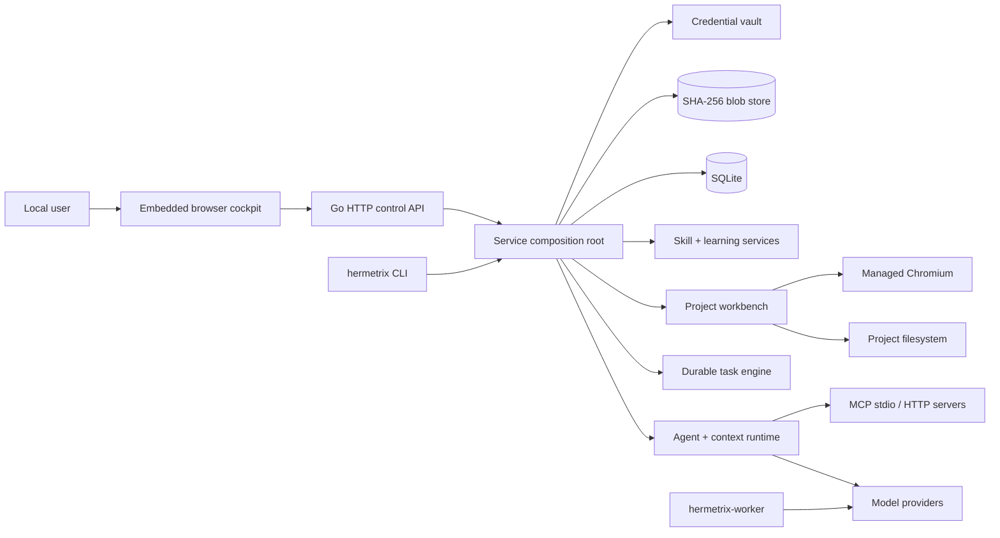
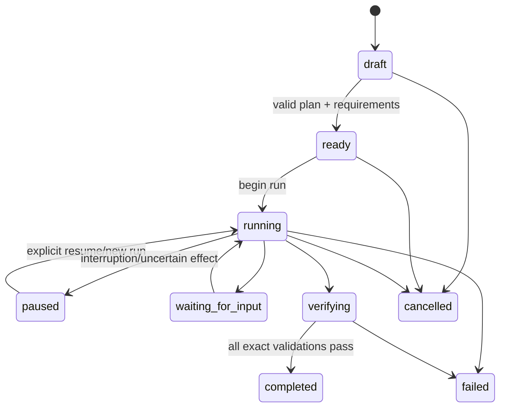
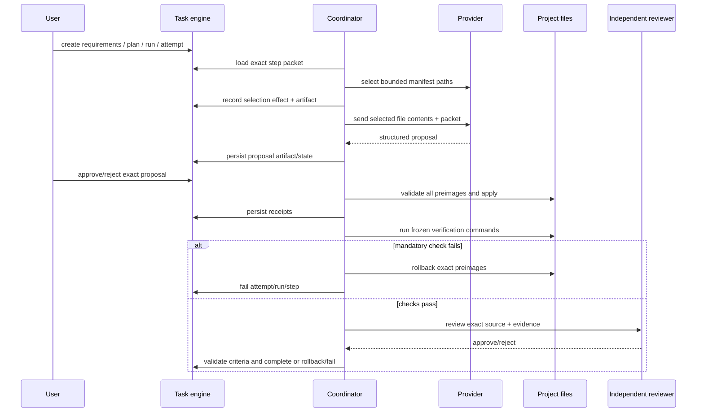
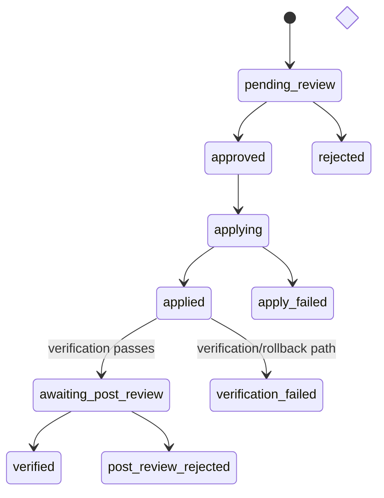

# Hermetrix Harness — Master Project Specification

Date: 2026-09-19
Status: Baseline and target specification
Current implementation baseline: Git `08fcac4`, SQLite schema v36
Target correction overlay: [2026-09-18-correctness-performance-remediation.md](2026-09-18-correctness-performance-remediation.md)
New feature implementation overlay: [Local multimodal, planner/worker and privacy](2026-09-19-local-multimodal-privacy-implementation.md). This TARGET overlay supersedes Project ownership/export semantics in this baseline where explicitly stated; it does not claim those features already exist. It separates principal ownership from Project association and preserves the distinct reviewer gate.
Evidence review: [../reviews/2026-09-18-project-review.md](../reviews/2026-09-18-project-review.md)

## 1. Document purpose and authority

เอกสารนี้เป็นสเปกภาพรวมของ Hermetrix Harness ทั้งระบบ ครอบคลุม product behavior, architecture, data, API, workflows, security, failure semantics, operations และ acceptance criteria โดยเขียนจาก implementation และ tests ที่มีอยู่จริง ณ baseline ข้างต้น

คำว่า SHALL, MUST และ MUST NOT เป็นข้อบังคับ คำว่า SHOULD เป็นค่าเริ่มต้นที่เปลี่ยนได้เมื่อมีหลักฐาน คำว่า MAY เป็นความสามารถเสริม

สถานะข้อกำหนดใช้สามระดับ:

| Status | Meaning |
|---|---|
| **Current** | มีเส้นทาง implementation และ/หรือ test อยู่ใน baseline schema v36 |
| **Target** | ต้องทำให้ครบตาม remediation spec ก่อนอ้างว่า qualified สำหรับการใช้งานกว้างขึ้น |
| **Future** | อยู่ใน roadmap แต่ไม่ใช่ contract ของ release ปัจจุบัน |

เมื่อเอกสารขัดกัน ให้ใช้ลำดับนี้:

1. persisted state และ observable runtime behavior สำหรับการอธิบาย baseline
2. เอกสารนี้สำหรับ intended product contract
3. remediation specification สำหรับรายละเอียดการแก้ R01–R16
4. architecture, handover และ historical phase documents

Behavior-changing pull request SHALL แก้เอกสารนี้หรือเอกสาร normative ที่อ้างอิงใน PR เดียวกัน

## 2. Product definition

Hermetrix Harness เป็น local-first agent workbench สำหรับทำงานกับหลาย model provider โดยรักษา authority, context, tool effects, source changes, evidence และ reusable Skills ให้ตรวจสอบย้อนกลับและกู้สถานะหลัง interruption ได้

ผลิตภัณฑ์แก้ปัญหาหลักหกด้าน:

1. เปิด agent session ด้วย model/context/capability contract ที่ไม่เปลี่ยนกลางงาน
2. ให้ model ใช้ local tools และ MCP โดยมี approval และ effect receipts
3. ทำ coding task ตั้งแต่ requirement, plan, proposal, apply, verification ถึง independent review
4. เรียนรู้และปรับปรุง Skill ผ่าน candidate/review/promotion ที่ reversible
5. บีบและค้น context ระยะยาวโดยไม่ทำ pinned intent หรือ causal pair หายเงียบ ๆ
6. ให้ผู้ใช้ควบคุม project, files, terminal, browser, artifacts, teams และ maintenance จาก cockpit เดียว

### 2.1 Product goals

SYS-001 (**Current**). ระบบ SHALL ทำงานได้แบบ single-host และเก็บข้อมูลหลักไว้ใน data root ที่ผู้ใช้กำหนด

SYS-002 (**Current**). ระบบ SHALL รองรับ OpenAI-compatible, Anthropic native และ Gemini native ผ่าน provider profile เดียวกันในระดับ common chat/tool contract

SYS-003 (**Current**). ทุก agent session SHALL freeze provider, model, context profile, policy, capability catalog, selected Skill versions และ budget ตอนสร้าง session

SYS-004 (**Current**). External effect SHALL มี intent, approval หรือ receipt ที่ตรวจสอบได้ตามชนิดของ workflow

SYS-005 (**Current**). Skill content ที่ active SHALL immutable; การแก้ไขสร้าง candidate/version ใหม่

SYS-006 (**Current**). Source-code workflow SHALL แยก proposal, human decision, apply, verification และ independent post-review

SYS-007 (**Current**). Interruption SHALL ไม่ replay provider, command, browser หรือ MCP effect ที่อาจเกิดขึ้นแล้วโดยอัตโนมัติ

SYS-008 (**Target**). ทุก authority-consuming transition SHALL ตรวจ authority แบบ transactional และทุก mutation SHALL ให้ผลลัพธ์ที่ตรงกับ state จริง

SYS-009 (**Target**). Performance optimization SHALL ไม่ลด auditability, context fidelity หรือ security boundary

SYS-010 (**Current**). UI SHALL แสดง capability และข้อจำกัดตาม backend จริง ไม่ใช้ placeholder ที่ดูเหมือนพร้อมใช้งาน

### 2.2 Non-goals for the current release

- multi-user identity, OAuth, organization RBAC หรือ tenant isolation
- distributed workers, multi-host consensus หรือ distributed leases
- autonomous mutation without the configured approval/authority policy
- automatic retry of an effect whose dispatch outcome is uncertain
- replacement of SQLite/CAS with a network database/object store
- general-purpose shell execution from untrusted strings
- guaranteed Windows kernel isolation equivalent to Linux namespaces
- exact tokenizer support for every provider/model
- native signed desktop installer, auto-update and mobile client
- production disaster recovery of every runtime entity from Skill portability export

## 3. Users and trust roles

| Role | Authority |
|---|---|
| Local operator | configures data root, listener, auth, TLS, provider, project and process lifecycle |
| Configured principal | uses cockpit/API and is recorded as actor for mutations; current product has one configured principal |
| Agent session | may sample only through its frozen contract and may call only bound tools |
| Durable task run owner | may advance task/effect state while its run lease is valid |
| Human reviewer | approves/denies exact tool effects and code proposals |
| Independent model reviewer | reviews exact applied source and verification evidence using a distinct provider/model boundary |
| Learning reviewer | may propose Skill candidates; cannot directly rewrite an active version outside authority policy |
| Curator | analyzes stale/duplicate Skill state and emits findings; report-only by default |
| MCP server | untrusted external capability source unless its annotation trust is explicitly enabled |
| Model provider | receives bounded prompt/tool schemas and returns untrusted model output |

TRUST-001 (**Current**). Model output, MCP payloads, browser DOM, imported backup data and project files SHALL be treated as untrusted input.

TRUST-002 (**Current**). Origin describes where knowledge came from; owner describes who controls it. The fields SHALL remain separate.

TRUST-003 (**Current**). A principal, agent, reviewer or server SHALL not gain wider authority from text contained in a prompt, file, web page, tool result or Skill body.

## 4. System context and deployment topology



### 4.1 Runtime processes

PLT-001 (**Current**). `hermetrix serve` SHALL compose all local services, migrate the store, recover interrupted work, start maintenance loops and serve the cockpit/API.

PLT-002 (**Current**). `hermetrix-worker` SHALL accept one bounded JSON coding task on stdin and emit one unverified proposal on stdout. It MUST NOT modify the source workspace.

PLT-003 (**Current**). `hermetrix corpus`, `taskeval` and `hostile` SHALL remain offline/evaluation commands and SHALL not be presented as cockpit product workflows.

PLT-004 (**Current**). Graceful shutdown SHALL cancel owned contexts, stop accepting work and give the HTTP server a bounded shutdown window.

PLT-005 (**Target**). One process SHALL exclusively own a data root. A second process opening the same root MUST fail startup before migration or mutation.

### 4.2 Data-root layout

| Path | Purpose |
|---|---|
| `hermetrix.db` | canonical SQLite state and derived indexes |
| `blobs/sha256/<prefix>/<suffix>` | content-addressed immutable payloads |
| `secrets.json` | provider and MCP credentials; excluded from backup/API |
| `desktop-profile/` | isolated Chromium profile for desktop mode |
| temporary `chrome-profile-*` | managed browser runtime profiles |
| backup/quarantine paths | export files and recoverable CAS quarantine when configured |

PLT-006 (**Current**). Blob references SHALL be lowercase SHA-256 content addresses and reads SHALL verify reference/path validity.

PLT-007 (**Current**). Credentials SHALL never enter SQLite rows, blob packages, logs, backup envelopes or API responses.

PLT-008 (**Target**). Windows credential persistence SHALL use DPAPI CurrentUser with atomic replacement; POSIX systems SHALL retain restrictive owner-only storage.

## 5. Configuration and startup

### 5.1 Serve flags

| Flag | Default | Contract |
|---|---:|---|
| `--data` | absolute `./.hermetrix` | data root |
| `--listen` | `127.0.0.1:7331` | HTTP listener |
| `--workspace` | `.` | initial registered/pinned Project root |
| `--open` | false | open default browser after listener starts |
| `--desktop` | false | launch isolated Chromium app window, fallback to `--open` |
| `--auth-token-env` | empty | environment variable holding control token |
| `--auth-principal` | `local-user` | recorded authenticated actor |
| `--tls-cert`, `--tls-key` | empty | required pair for non-loopback listener |
| provider flags | optional | seed/update one startup provider profile |
| embedding flags | disabled | opt-in OpenAI-compatible semantic retrieval |
| `--debug` | false | debug-level structured logs |

CFG-001 (**Current**). A non-loopback listener SHALL require both authentication and TLS.

CFG-002 (**Current**). Auth token SHALL be read only from the named environment variable and SHALL contain at least 32 characters.

CFG-003 (**Current**). Provider startup configuration SHALL require both base URL and model when any provider seed flag is supplied.

CFG-004 (**Current**). Embeddings SHALL remain optional. With no embedding endpoint, lexical retrieval is a supported configuration.

CFG-005 (**Current**). Semantic embedding endpoint revision SHALL include endpoint/model/dimensions; the Target correction extends it with normalization/chunking revision.

CFG-006 (**Current**). Stored credentials SHALL override environment-backed credentials for the same profile reference.

## 6. Security specification

### 6.1 HTTP boundary

SEC-001 (**Current**). The listener SHALL default to loopback.

SEC-002 (**Current**). Authenticated browser flow SHALL exchange the control token for an HMAC-signed, 12-hour, `HttpOnly`, `SameSite=Strict` cookie; secure cookies SHALL be used with TLS.

SEC-003 (**Current**). A mutating authenticated request MUST NOT claim an actor different from the configured principal.

SEC-004 (**Current**). Responses SHALL include CSP, `X-Content-Type-Options: nosniff`, `X-Frame-Options: DENY` and `Referrer-Policy: no-referrer`.

SEC-005 (**Target**). Host, Origin, Fetch Metadata and JSON media type SHALL be validated as specified by remediation SEC-001–012.

SEC-006 (**Target**). Unknown Host SHALL fail before authentication/body parsing; cross-site browser mutation SHALL fail before route execution.

SEC-007 (**Target**). JSON request decoding SHALL accept exactly one document, reject unknown fields and enforce endpoint/body limits.

### 6.2 Filesystem and process boundary

SEC-008 (**Current**). Project-relative paths SHALL reject absolute paths, traversal, symlink escape and non-regular files where applicable.

SEC-009 (**Current**). Managed commands SHALL execute an allowlisted executable directly without a shell.

SEC-010 (**Current**). Command working directory SHALL remain inside the selected Project root and timeout SHALL be 1–600 seconds.

SEC-011 (**Current**). macOS commands SHALL use Seatbelt; Linux SHALL use Bubblewrap when installed and MAY fail closed via `HERMETRIX_REQUIRE_OS_SANDBOX=1`.

SEC-012 (**Current**). Windows SHALL provide process-tree lifetime containment with a Job Object; it SHALL NOT claim filesystem/network isolation.

SEC-013 (**Current**). Managed browser navigation SHALL accept HTTP/HTTPS and project-bound `file:` URLs. Private/local network access requires explicit opt-in.

SEC-014 (**Current**). Browser DOM, element references and screenshots are evidence, never trusted authority.

### 6.3 Egress and secret handling

SEC-015 (**Current**). Remote providers SHALL require HTTPS URLs without embedded credentials, query strings or fragments where configured by CLI/worker policy.

SEC-016 (**Current**). Before project file content leaves the host, the workflow SHALL verify provider credential readiness and record the exact provider revision.

SEC-017 (**Current**). MCP stdio children SHALL receive only a minimal environment plus their own credential.

SEC-018 (**Current**). Secrets SHALL be redacted from errors, metrics, artifacts, command environment receipts and exported data.

## 7. Projects and workbench

### 7.1 Project model

PRJ-001 (**Current**). Project is the root scope for sessions, files, jobs, artifacts, browser files, teams and durable tasks.

PRJ-002 (**Current**). A Project MAY have an empty root path. This is a permanent codeless Project state, not incomplete setup.

PRJ-003 (**Current**). Project names SHALL be unique. Rooted Projects SHALL use normalized roots and duplicate non-empty roots SHALL be rejected.

PRJ-004 (**Current**). Project pin/open operations SHALL persist ordering metadata independently from code-root capability.

PRJ-005 (**Current**). Root-required operations on a codeless Project SHALL return a stable domain error and SHALL not invent a default directory.

### 7.2 File browser and editor

PRJ-006 (**Current**). File browsing SHALL remain within root and return bounded directory entries.

PRJ-007 (**Current**). File reads SHALL accept UTF-8 regular files up to 2 MiB and return content plus SHA-256 revision.

PRJ-008 (**Current**). File writes SHALL require the expected SHA-256 for replacement and create immutable diff/receipt evidence.

PRJ-009 (**Target**). Compare-and-write SHALL be atomic for cooperating Hermetrix writers through process ownership, canonical path locks and a final preimage check.

PRJ-010 (**Target**). A file mutation SHALL create a durable intent before replacement and expose committed-but-receipt-failed distinctly.

### 7.3 Commands and terminal

PRJ-011 (**Current**). Background commands SHALL persist job metadata, bounded output, terminal artifact and cancellation state.

PRJ-012 (**Current**). Default direct command allowlist is `go`, `git`, `node`, `npm`, `python`, `python3`, `rg` and `ls`, subject to OS availability.

PRJ-013 (**Current**). Unix terminals SHALL use a real PTY with input, resize, interrupt and close operations and a bounded persisted tail.

PRJ-014 (**Current**). Restart SHALL mark a live terminal interrupted and SHALL NOT replay its process.

PRJ-015 (**Current**). Windows interactive terminal SHALL use ConPTY with bounded output, input, resize, interrupt, close and process-tree cleanup; capability/UI state SHALL report runtime availability truthfully.

PRJ-016 (**Target**). Child environment SHALL provide a writable per-job temp directory and toolchain cache paths without leaking process secrets.

### 7.4 Managed browser

PRJ-017 (**Current**). Each managed browser runtime SHALL use an isolated temporary Chromium profile and DevTools connection.

PRJ-018 (**Current**). Browser actions SHALL be bounded to supported navigation, snapshot, element interaction and screenshot operations.

PRJ-019 (**Current**). A browser tab SHALL persist bounded URL/title/text/link/element evidence and lifecycle state.

PRJ-020 (**Current**). Browser process interruption SHALL mark state interrupted; navigation/action SHALL not replay after uncertain transport failure.

### 7.5 Deliverables

PRJ-021 (**Current**). Structured deliverable creation SHALL support DOCX, XLSX, PPTX and PDF.

PRJ-022 (**Current**). A deliverable SHALL be stored as an immutable Artifact with checksum, MIME type, byte size and actor.

PRJ-023 (**Current**). Limits are 2,000 paragraphs, 20,000 spreadsheet cells, 200 slides and 16 MiB artifact payload unless a stricter format limit applies.

PRJ-024 (**Current**). PDF SHALL reject unsupported Unicode instead of silently losing glyphs; current native PDF scope is printable Basic Latin.

## 8. Provider registry and model qualification

PRO-001 (**Current**). Provider profile SHALL contain adapter kind, base URL, model, credential reference, context window/evidence, max output, enabled state and immutable revision digest.

PRO-002 (**Current**). Updating behaviorally relevant provider fields SHALL change profile revision.

PRO-003 (**Current**). API responses SHALL report only credential readiness/stored state, never credential bytes.

PRO-004 (**Current**). Supported adapters are `openai-compatible`, `anthropic-native` and `gemini-native`.

PRO-005 (**Current**). Provider test SHALL return latency, sample, finish reason and usage without changing session contracts.

PRO-006 (**Current**). Token overhead measurement SHALL update per-profile request/message overhead evidence.

PRO-007 (**Current**). Runtime observations MAY calibrate reasoning ratio, token multiplier and non-ASCII rate for future sessions; active Session Contract values SHALL not move.

PRO-008 (**Current**). Qualification SHALL distinguish declared context, probed runtime allocation and behavioral qualification.

PRO-009 (**Current**). A certified context profile SHALL require evidence for the loaded runtime/model; remote metadata alone SHALL not certify local allocation.

PRO-010 (**Current**). Qualification output SHALL preserve individual checks, recall positions, latency and decision rationale.

PRO-011 (**Target**). Every provider request SHALL flow through the inference scheduler and record reservation, queue/provider timing, usage quality and terminal reason.

PRO-012 (**Target**). EOF/partial streaming without a legal finish reason SHALL produce incomplete evidence and SHALL not complete a turn or dispatch tool calls.

## 9. Agent sessions and turns

### 9.1 Session creation

SES-001 (**Current**). Creating a session SHALL require title, provider selection and context profile; Project binding is optional.

SES-002 (**Current**). Routing SHALL be resolved before Session Contract creation. Ordered failover selects the first enabled, credential-ready and qualified candidate.

SES-003 (**Current**). After sampling starts, a turn SHALL NOT silently fail over to another provider.

SES-004 (**Current**). Session Contract SHALL freeze provider ID/revision/model, context profile, Project, policy revision, capability revision, tool bindings, Skill catalog/selections, qualification binding, cache epoch, budget, reasoning ratio and answer budget.

SES-005 (**Current**). Qualification override SHALL require actor, reason and expiry/binding metadata.

### 9.2 Turn execution

SES-006 (**Current**). User message append and per-session turn lease acquisition SHALL occur atomically so concurrent requests cannot both own one session turn.

SES-007 (**Current**). Each model step SHALL persist an immutable StepBinding and context snapshot before/with the request evidence required for reconstruction.

SES-008 (**Current**). Turn loop SHALL be bounded by model steps, tool calls, wall time and cumulative tokens.

SES-009 (**Current**). Streaming endpoint SHALL emit NDJSON events for start/delta/approval/completion/failure and keep the turn ID stable.

SES-010 (**Current**). On restart, an orphaned active turn SHALL close as interrupted/failed without replaying provider or tools.

SES-011 (**Current**). Session deletion SHALL remove session-owned relational state and derived retrieval data while respecting referenced durable artifacts.

SES-012 (**Target**). Every sampling/resume path SHALL run the same frozen-contract validator immediately before provider dispatch.

SES-013 (**Target**). Approval persistence, effect execution and model continuation SHALL be separate phases; contract drift after effect completion yields `continuation_blocked`.

### 9.3 Tool approvals

SES-014 (**Current**). Approval SHALL bind session, turn, step binding, tool call ID/name/revision, effect, exact arguments hash and preview.

SES-015 (**Current**). Approval decision SHALL be one-shot and record actor, reason, timestamp and receipt event.

SES-016 (**Current**). Approving an exact effect SHALL not authorize changed arguments, a different tool revision or another turn.

SES-017 (**Current**). Denial SHALL resume the model with an explicit denial receipt when the frozen contract remains valid.

## 10. Context compilation and retrieval

CTX-001 (**Current**). Context input SHALL use typed fragments including system, Skill/project, pinned, active, tool result and checkpoint kinds.

CTX-002 (**Current**). Profiles SHALL support 32k, 64k, 96k, 128k, 256k and 1M envelopes with explicit output/uncertainty/tool-burst reserves.

CTX-003 (**Current**). Compiler SHALL reserve output, uncertainty and worst-case next tool burst before selecting active content.

CTX-004 (**Current**). Pinned goal/criteria that cannot fit SHALL fail closed instead of truncating silently.

CTX-005 (**Current**). Tool call and matching result SHALL be selected, compacted or omitted as one causal unit.

CTX-006 (**Current**). Deduplication SHALL be deterministic. Large tool output MAY spill to CAS with a receipt/reference.

CTX-007 (**Current**). Compaction SHALL produce structured extractive checkpoints and run an independent verifier; failure SHALL use an extractive fallback or fail closed.

CTX-008 (**Current**). Context report SHALL expose original/selected/predicted tokens, slices, reserves, drops, spills, compaction and integrity metrics.

CTX-009 (**Current**). Adaptive estimator SHALL learn per provider/model from actual usage while preserving the prediction recorded for each request.

CTX-010 (**Current**). Lexical history/Skill retrieval SHALL support exact substrings, identifiers and Thai/unspaced-script grams where terms overlap.

CTX-011 (**Current**). Semantic retrieval SHALL be optional and fall back to lexical behavior on absence/failure.

CTX-012 (**Target**). Canonical events SHALL be paginated and context compilation SHALL start from a revision-bound incremental checkpoint instead of rescanning all history.

CTX-013 (**Target**). Snapshot compiled payloads SHALL move to CAS references while retaining inline historical read compatibility.

CTX-014 (**Target**). Semantic query embeddings SHALL be cached by full embedding revision and bounded by a foreground deadline.

CTX-015 (**Target**). SQLite reader pooling SHALL be enabled only after measured DB wait crosses the remediation threshold.

## 11. Direct tools and MCP

### 11.1 Direct tools

TOL-001 (**Current**). Core registry SHALL expose only versioned definitions bound into the Session Contract.

TOL-002 (**Current**). Direct tools SHALL return normalized receipts and declare effect/approval policy.

TOL-003 (**Current**). Workspace reads/search SHALL be bounded by Project root, size and result limits.

TOL-004 (**Current**). `workspace.write_file` SHALL pause for exact approval and require preimage evidence.

TOL-005 (**Current**). Tool lookup SHALL not resolve a definition added or changed after the session capability revision.

### 11.2 Deferred capability catalog

TOL-006 (**Current**). The model-facing deferred catalog SHALL expose `tool_search`, `tool_describe` and `tool_call` rather than injecting every remote schema.

TOL-007 (**Current**). Search result SHALL identify source, catalog kind, server/revision and bounded summary.

TOL-008 (**Current**). `tool_call` SHALL validate JSON arguments against the exact discovered schema and server revision.

### 11.3 MCP server lifecycle

TOL-009 (**Current**). MCP SHALL support stdio and Streamable HTTP transports, current protocol `2026-07-28` and legacy `2025-11-25` negotiation.

TOL-010 (**Current**). Discovery SHALL fetch tools, resources and prompts and atomically replace one server's catalog snapshot.

TOL-011 (**Current**). Catalog bounds are 2,000 stored entries per kind, 10,000 remote tools, 100 list pages and 8 MiB response.

TOL-012 (**Current**). Stdio process SHALL be pooled, expire after idle timeout and be discarded after timeout/cancellation or uncertain connection failure.

TOL-013 (**Current**). Read-only discovery MAY reconnect once. Tool calls, resource reads and prompt rendering MUST NOT replay after uncertain failure.

TOL-014 (**Current**). Risk annotations are untrusted by default; remote tool mutation requires approval unless annotation trust is explicitly enabled for that server.

TOL-015 (**Current**). Trusted stdio server sampling SHALL use the session provider, max 1,024 output tokens and at most four samples per tool call.

TOL-016 (**Current**). Trusted stdio elicitation SHALL create a user-visible question with a three-minute bound and distinguish decline from timeout/cancel.

TOL-017 (**Current**). Streamable HTTP server-initiated sampling/elicitation remains unsupported and SHALL receive an explicit refusal.

TOL-018 (**Target**). MCP sampling ownership and remaining budget SHALL be request-scoped; global mutable current-session state SHALL be removed.

## 12. Skills, learning and curation

### 12.1 Skill lifecycle

SKL-001 (**Current**). Skill SHALL have canonical name, scope, origin, owner, state, controls and current immutable version.

SKL-002 (**Current**). Scope SHALL distinguish global/project/other supported scope kinds and an optional scope reference.

SKL-003 (**Current**). Create, improve, fork and restore SHALL produce a candidate; active content SHALL not be edited in place.

SKL-004 (**Current**). Candidate SHALL bind change kind, target/base version, candidate hash/blob, trigger, reason, evidence, checks and optimistic revision.

SKL-005 (**Current**). Promotion SHALL require ready state, passing lint/checks, unchanged base revision and required replay/capability/behavioral evidence.

SKL-006 (**Current**). Reject SHALL record reviewer/reason and SHALL not remove the candidate's audit record.

SKL-007 (**Current**). Archive SHALL preserve exact version/blob/provenance and controls; restore SHALL create a candidate.

SKL-008 (**Current**). Protected Skill restrictions SHALL fail closed. Hard deletion is outside the product contract.

SKL-009 (**Current**). Relation analysis SHALL be version-bound and report duplicate/overlap evidence without mutating Skill state.

SKL-010 (**Current**). Activation SHALL record selection source/reason, whether metadata/body entered context, relevant calls and attributed outcome.

### 12.2 Runtime selection

SKL-011 (**Current**). Session SHALL freeze a metadata catalog and exact selected Skill versions.

SKL-012 (**Current**). Pinned/required Skill floor MAY preload bodies; other bodies SHALL be fetched lazily through Skill tools.

SKL-013 (**Current**). A Skill promoted after session creation SHALL be refused in that session unless its exact version was frozen.

SKL-014 (**Current**). Retrieval metrics SHALL report model-specific `no_skill_requested_rate`, script-blind cases and sample-qualified verdicts.

### 12.3 Learning and authority

LRN-001 (**Current**). Completed turn SHALL write learning trigger outbox in the same transaction as turn commit.

LRN-002 (**Current**). Background reviewer SHALL be persisted, idempotent and proposal-only.

LRN-003 (**Current**). Learning review SHALL retain input digest, reviewer revision, decision, attempts, candidate binding and error.

LRN-004 (**Current**). Skill authority policy SHALL choose manual or allowed automatic promotion; every automatic action SHALL be recorded and reversible.

LRN-005 (**Current**). Automatic archiving SHALL remain disabled unless a future explicit policy authorizes it.

LRN-006 (**Current**). Curator SHALL operate report-only, persist input snapshot/finding counts and never merge/archive automatically.

LRN-007 (**Current**). Replay fixtures SHALL compare baseline and candidate with a no-regression gate.

LRN-008 (**Current**). Capability review and behavioral evaluation SHALL bind the candidate revision they assessed.

## 13. Durable task engine

### 13.1 Task and requirement model

TSK-001 (**Current**). Durable Task SHALL bind Project, title, objective, state, optimistic revision and active requirement/plan revisions.

TSK-002 (**Current**). Requirement revision SHALL be immutable and contain objective plus stable criterion IDs/text.

TSK-003 (**Current**). Revising requirements SHALL create the next immutable revision and invalidate readiness/evidence that no longer describes the active subject.

TSK-004 (**Current**). Task completion SHALL require validation evidence for every active criterion against the exact current subject revision.

### 13.2 Plan and scheduler

TSK-005 (**Current**). Plan revision SHALL be immutable and contain ordered steps with stable ID, dependencies, acceptance criterion mapping, checks and effect scope.

TSK-006 (**Current**). Plan validation SHALL reject cycles, missing dependencies, duplicate IDs and incomplete/invalid criterion coverage.

TSK-007 (**Current**). Automatic planner SHALL receive only an immutable task/requirement bundle and persist planned/dispatched/observed/failure state without retrying uncertain provider dispatch.

TSK-008 (**Current**). Runnable step selection SHALL be deterministic from active plan, dependency completion and step state.

TSK-009 (**Current**). Next-step packet SHALL contain exact task/requirement/plan revision, authoritative criteria, evidence, checkpoint and unresolved effects.

TSK-010 (**Current**). Packet serialization SHALL be canonical and hashed. Oversize authoritative content SHALL fail closed instead of truncating constraints.

### 13.3 Run, attempt and effect state

TSK-011 (**Current**). At most one `running` run SHALL exist per Task.

TSK-012 (**Current**). Run SHALL persist owner, lease token, lease expiry and active requirement/plan revision.

TSK-013 (**Current**). Attempt SHALL bind one run, task, step, sequence and exact packet/hash.

TSK-014 (**Current**). Effect intent SHALL bind attempt, task, operation ID, action, target, authority, state, receipt and error.

TSK-015 (**Current**). Effect action SHALL be present in the frozen step effect scope.

TSK-016 (**Current**). Crash recovery SHALL mark pre-dispatch `planned` effects abandoned and post-dispatch unobserved effects uncertain.

TSK-017 (**Current**). An uncertain effect SHALL block new run/resume until explicit target-specific reconciliation.

TSK-018 (**Current**). Observation/reconciliation SHALL use the existing operation ID and SHALL not dispatch a new effect.

TSK-019 (**Target**). Planning, dispatch and attempt completion SHALL require live `RunAuthority{run_id,lease_token}` checked transactionally.

TSK-020 (**Target**). Effect rows SHALL bind run ID and lease generation; late observation SHALL remain possible after lease expiry.

### 13.4 Task states



TSK-021 (**Current**). Supported Task states are `draft`, `ready`, `running`, `waiting_for_input`, `paused`, `verifying`, `completed`, `failed` and `cancelled`.

TSK-022 (**Current**). Supported step states are `pending`, `running`, `completed`, `blocked`, `failed` and `skipped`.

TSK-023 (**Current**). Validation verdicts are `pass`, `fail`, `blocked` and `unknown` and SHALL retain evidence references.

TSK-024 (**Current**). Checkpoint SHALL bind exact requirement/plan revisions and persist summary, completed work, next action, blocker and evidence references.

## 14. Code proposal workflow

### 14.1 End-to-end workflow



COD-001 (**Current**). File selection SHALL inspect a bounded source-like manifest without following symlinks or including sensitive/generated paths.

COD-002 (**Current**). Selection provider request SHALL not include file content and SHALL select at most 32 explicit paths.

COD-003 (**Current**). Proposal provider SHALL receive only selected bounded files, exact packet and immutable provider binding.

COD-004 (**Current**). Proposal SHALL contain structured file changes with preimage hash and complete replacement content/edit contract accepted by the worker validator.

COD-005 (**Current**). Proposal creation SHALL not write the Project filesystem.

COD-006 (**Current**). Proposal artifact and registry row SHALL bind task, step, attempt, packet hash, provider revision and result hash.

COD-007 (**Current**). Human decision is one-shot: pending proposal may become approved or rejected with reviewer/rationale/findings.

COD-008 (**Current**). Apply SHALL start only from approved state and validate every preimage before the first write.

COD-009 (**Current**). Multi-file failure SHALL rollback already-written files in reverse order and record per-file results.

COD-010 (**Current**). Verification command set SHALL cover every frozen step check exactly once and reject shell control syntax.

COD-011 (**Current**). Commands SHALL run through managed background jobs and produce an immutable verification evidence bundle.

COD-012 (**Current**). Mandatory verification failure SHALL rollback and fail the proposal attempt/run/step.

COD-013 (**Current**). Post-review provider SHALL differ from implementer in provider identity and model or endpoint boundary as enforced by current coordinator policy.

COD-014 (**Current**). Independent reviewer SHALL receive exact applied source and verification evidence, not a regenerated summary.

COD-015 (**Current**). Approved post-review SHALL promote criterion validations and allow task completion; rejection SHALL rollback/fail.

COD-016 (**Target**). Proposal row SHALL store direct rollback and verification artifact IDs; review/rollback MUST NOT rediscover them through a recent-list scan.

COD-017 (**Target**). Proposal recovery ambiguity SHALL enter `recovery_required` and block automatic continuation.

### 14.2 Proposal state machine



COD-018 (**Current**). Current states are `pending_review`, `approved`, `rejected`, `applying`, `applied`, `apply_failed`, `awaiting_post_review`, `verified`, `verification_failed` and `post_review_rejected`.

COD-019 (**Target**). `recovery_required` SHALL be an operator-visible hold state introduced by remediation schema v38.

## 15. Agent teams

TEAM-001 (**Current**). Team definition SHALL be reusable, Project-bound and contain one or more versioned members.

TEAM-002 (**Current**). Exactly one active member SHALL be lead.

TEAM-003 (**Current**). Team run SHALL snapshot team/member instructions, provider/context/Project binding, objective and task DAG.

TEAM-004 (**Current**). Task DAG SHALL reject missing members, duplicate task IDs, missing dependencies and cycles.

TEAM-005 (**Current**). Scheduler SHALL run dependency-ready child tasks with `max_parallel` bounded to 1–4.

TEAM-006 (**Current**). Every child SHALL run in its own Agent Session and preserve provider, context, usage and provenance.

TEAM-007 (**Current**). Exact-effect approval SHALL pause only the affected child task and persist approval ID/state.

TEAM-008 (**Current**). Approve/deny SHALL resume the existing child turn from its persisted approval receipt without replaying its prompt or earlier effects.

TEAM-009 (**Current**). Run cancellation SHALL propagate to active child contexts and mark queued/running tasks cancelled; completed effects are not undone automatically.

TEAM-010 (**Current**). Run output SHALL aggregate child usage/provenance without erasing child-level evidence.

TEAM-011 (**Target**). Concurrent provider calls from teams SHALL use scheduler resource keys and request-scoped MCP ownership.

## 16. Artifacts, memory, settings and usage

ART-001 (**Current**). Artifact SHALL bind Project, name, kind, MIME type, blob ref, checksum, byte size, actor, metadata and creation time.

ART-002 (**Current**). Artifact payload SHALL be immutable and content-addressed. Generic artifact size SHALL not exceed 16 MiB.

ART-003 (**Current**). Image composer upload SHALL not exceed 8 MiB.

ART-004 (**Current**). Artifact content endpoint SHALL stream stored bytes with declared MIME/disposition and checksum-backed identity.

ART-005 (**Current**). Settings SHALL be explicit key/value preferences and SHALL not contain provider/MCP secrets.

ART-006 (**Current**). Memory SHALL have scope, content, state and archive operation; archiving preserves audit state.

ART-007 (**Current**). Usage summary SHALL report persisted model/tool/runtime usage available from current events/receipts.

ART-008 (**Current**). Token accuracy SHALL be reported per provider/model with current-window error, lifetime sample, overflow count and sample-qualified verdict.

ART-009 (**Target**). Usage SHALL distinguish actual, estimated and unknown and include nested MCP/reviewer calls under the initiating owner.

## 17. Backup, import and maintenance

### 17.1 Skill portability export

OPS-001 (**Current**). Existing backup endpoint SHALL export only its allowlisted Skill portability tables and referenced blobs into a checksum-verified envelope.

OPS-002 (**Current**). Export/import payload SHALL not exceed 256 MiB.

OPS-003 (**Current**). Import SHALL have a preview phase that verifies envelope/checksum/blobs and reports conflicts before mutation.

OPS-004 (**Current**). Apply import SHALL restore content as candidates; it SHALL not directly make imported Skill versions active.

OPS-005 (**Current**). Missing/corrupt referenced blob SHALL fail the operation rather than produce a partial valid-looking Skill.

OPS-006 (**Target**). UI/docs SHALL call this operation Skill portability export, not full system backup.

OPS-007 (**Target**). Export SHALL read a consistent DB snapshot and a matching verified blob set.

### 17.2 Full recovery

OPS-008 (**Target**). Full recovery procedure SHALL separately cover SQLite, WAL/SHM, CAS, encrypted credential vault and version/restore compatibility.

OPS-009 (**Target**). Recovery drill SHALL restore to a new data root, run integrity/foreign-key/blob checks and start in a non-destructive inspection mode before qualification.

### 17.3 Maintenance and GC

OPS-010 (**Current**). Maintenance schedule SHALL record trigger, enabled state, interval/idle requirements and next/last execution.

OPS-011 (**Current**). Due maintenance SHALL inspect current system activity and SHALL not run unsafe work during active foreground state.

OPS-012 (**Current**). CAS GC SHALL begin with dry-run and persist candidate refs/counts/bytes.

OPS-013 (**Current**). Applying GC SHALL move blobs to recoverable quarantine rather than hard-delete immediately.

OPS-014 (**Current**). Restore SHALL verify quarantined content hash before returning it to CAS.

OPS-015 (**Target**). Metrics and logs SHALL use bounded labels and exclude prompt, tool arguments, raw content and credentials.

## 18. Cockpit UI specification

### 18.1 Information architecture

UI-001 (**Current**). Project picker SHALL be the first scope decision and SHALL support rooted and codeless Projects.

UI-002 (**Current**). Primary views are Chat, Work, Code and Knowledge.

UI-003 (**Current**). Chat is the complete conversational surface. Work and Knowledge SHALL state incomplete scope explicitly where applicable.

UI-004 (**Current**). Code/workbench MAY show up to four panes for files, terminal, browser, artifacts/jobs or team tools according to current UI configuration.

UI-005 (**Current**). Rail and side pane SHALL be independently collapsible/resizable; per-Project/per-view layout SHALL persist client-side.

UI-006 (**Current**). Command palette SHALL open with Cmd/Ctrl+K and expose available page/workbench actions.

### 18.2 Chat and composer

UI-007 (**Current**). Enter sends, Shift+Enter inserts a line, Cmd/Ctrl+Enter sends, Escape clears an unsent draft and Up recalls the prior message when empty.

UI-008 (**Current**). `@` SHALL open a session-aware Skill/tool picker.

UI-009 (**Current**). Streaming rerenders SHALL preserve unsent draft, caret and focus.

UI-010 (**Current**). Pending approval SHALL remain visible with exact effect preview and approve/deny controls.

UI-011 (**Current**). Review pane SHALL show model, context, Project, Skills, direct-tool count, approvals and contract revisions.

### 18.3 Resilience and performance

UI-012 (**Current**). Every list endpoint consumed as an array SHALL render empty state from `[]`, not crash on `null`.

UI-013 (**Current**). Project/session switch during an in-flight request SHALL not apply stale response state to the newly selected scope.

UI-014 (**Target**). Initial readiness SHALL depend only on auth, Projects, selected Project sessions and minimal capability summary; optional panels load independently.

UI-015 (**Target**). Long timelines SHALL use cursor pagination and DOM virtualization/windowing.

UI-016 (**Target**). Stream reducer SHALL bind updates to session/turn, tolerate duplicate terminal messages and preserve incomplete-provider state.

UI-017 (**Target**). Required browser E2E absence SHALL fail a release job; skip is not a pass.

## 19. API contract

API-001 (**Current**). API base is `/api`; unmatched path or wrong method SHALL return JSON `404`, never SPA HTML.

API-002 (**Current**). JSON responses use `application/json; charset=utf-8`. Empty list responses SHALL encode `[]`.

API-003 (**Current**). Generic JSON body ceiling is 10 MiB; upload/backup/provider-specific paths MAY impose stricter limits.

API-004 (**Current**). Request structs SHALL reject unknown JSON fields.

API-005 (**Current**). Standard status classes are `400` invalid input, `401` unauthenticated, `403` policy/actor denial, `404` missing, `409` revision/state conflict, `422` domain precondition, `499` cancelled, `502` remote failure and `504` timeout.

API-006 (**Target**). Boundary errors SHALL move to stable `{error:{code,message,request_id}}` envelopes with one-release compatibility parsing.

API-007 (**Current**). Session turn response SHALL stream NDJSON rather than one buffered JSON result.

API-008 (**Current**). Binary artifact/backup download SHALL use bounded stored content and correct content headers.

### 19.1 Complete route catalog (schema v36)

The control surface contains 148 registered mux patterns and 150 method/path operations because the authentication path handles three methods. Path parameters are shown with braces.

#### System, authentication and model infrastructure

```text
GET    /api/auth/session
POST   /api/auth/session
DELETE /api/auth/session
GET    /api/health
GET    /api/bootstrap
GET    /api/context/profiles
POST   /api/context/compile
POST   /api/context/observe
GET    /api/fidelity/cases
POST   /api/fidelity/cases
GET    /api/fidelity/runs
POST   /api/fidelity/cases/{id}/run
POST   /api/local-model/probe
GET    /api/qualifications
POST   /api/qualifications
GET    /api/providers
POST   /api/providers
PUT    /api/providers/{id}/credential
POST   /api/providers/{id}/test
POST   /api/providers/{id}/measure-overhead
```

#### Skills, learning and curation

```text
GET    /api/skills
GET    /api/skills/{id}
PATCH  /api/skills/{id}
POST   /api/skills/custom
POST   /api/skills/{id}/improvements
POST   /api/skills/{id}/fork
POST   /api/skills/{id}/archive
GET    /api/candidates
GET    /api/candidates/{id}
POST   /api/candidates
PATCH  /api/candidates/{id}
GET    /api/candidates/{id}/replays
POST   /api/candidates/{id}/replays
GET    /api/candidates/{id}/behavioral-eval
POST   /api/candidates/{id}/behavioral-eval
POST   /api/candidates/{id}/capability-review
POST   /api/candidates/{id}/promote
POST   /api/candidates/{id}/reject
GET    /api/archives
POST   /api/archives/{id}/restore
GET    /api/relations
POST   /api/analysis/relations
POST   /api/activations
GET    /api/reviews
POST   /api/reviews
POST   /api/reviews/run-next
GET    /api/skill-authority
PUT    /api/skill-authority
POST   /api/skill-authority/run
GET    /api/skill-authority/actions
POST   /api/skill-authority/actions/{id}/rollback
GET    /api/curator/runs
POST   /api/curator/run
GET    /api/curator/findings
```

#### MCP and capability catalog

```text
GET    /api/mcp/servers
POST   /api/mcp/servers
PUT    /api/mcp/servers/{id}/credential
POST   /api/mcp/servers/{id}/discover
GET    /api/capabilities
GET    /api/capabilities/{id}
GET    /api/elicitations
POST   /api/elicitations/{id}/answer
```

#### Agent sessions

```text
GET    /api/sessions
POST   /api/sessions
GET    /api/sessions/{id}
POST   /api/sessions/{id}/turns
DELETE /api/sessions/{id}
POST   /api/approvals/{id}/decisions
```

#### Durable tasks and code proposals

```text
GET    /api/tasks
POST   /api/tasks
GET    /api/tasks/{id}
GET    /api/tasks/{id}/next-packet
GET    /api/tasks/{id}/execution
POST   /api/tasks/{id}/auto-plan
POST   /api/tasks/{id}/runs
POST   /api/tasks/{id}/requirements
POST   /api/tasks/{id}/plans
POST   /api/tasks/{id}/steps/{step}/transitions
POST   /api/tasks/{id}/validations
POST   /api/tasks/{id}/checkpoints
POST   /api/tasks/{id}/complete
POST   /api/task-runs/{id}/lease
POST   /api/task-runs/{id}/attempts
POST   /api/task-attempts/{id}/effects
POST   /api/task-attempts/{id}/select-files
POST   /api/task-attempts/{id}/proposals
POST   /api/task-attempts/{id}/complete
GET    /api/task-code-proposals/{id}
POST   /api/task-code-proposals/{id}/decision
POST   /api/task-code-proposals/{id}/apply
POST   /api/task-code-proposals/{id}/verify
POST   /api/task-code-proposals/{id}/verify-frozen
POST   /api/task-code-proposals/{id}/post-review
POST   /api/task-effects/{operation}/transitions
POST   /api/task-effects/{operation}/reconcile-workspace-run
POST   /api/task-effects/{operation}/reconcile
POST   /api/task-effects/reconcile-uncertain
```

#### Project workbench and teams

```text
GET    /api/filesystem/directories
GET    /api/projects
POST   /api/projects
PUT    /api/projects/{id}/pin
POST   /api/projects/{id}/open
GET    /api/projects/{id}/files
GET    /api/projects/{id}/file
PUT    /api/projects/{id}/file
POST   /api/projects/{id}/commands
GET    /api/terminals
POST   /api/terminals
GET    /api/terminals/{id}/output
POST   /api/terminals/{id}/input
POST   /api/terminals/{id}/resize
POST   /api/terminals/{id}/close
GET    /api/browser/tabs
POST   /api/browser/tabs
POST   /api/browser/tabs/{id}/actions
GET    /api/teams
POST   /api/teams
GET    /api/team-runs
POST   /api/team-runs
GET    /api/team-runs/{id}
POST   /api/team-runs/{id}/cancel
POST   /api/team-runs/{id}/tasks/{task}/approval
GET    /api/jobs
POST   /api/jobs/{id}/cancel
```

#### Artifacts, preferences and operations

```text
GET    /api/artifacts
POST   /api/artifacts
POST   /api/artifacts/upload
POST   /api/deliverables
GET    /api/artifacts/{id}/content
GET    /api/settings
PUT    /api/settings
GET    /api/memories
POST   /api/memories
POST   /api/memories/{id}/archive
GET    /api/usage
GET    /api/skill-retrieval
GET    /api/token-accuracy
GET    /api/backups
POST   /api/backups
GET    /api/backups/{id}/download
POST   /api/imports/preview
POST   /api/imports/{id}/apply
GET    /api/maintenance/schedules
POST   /api/maintenance/schedules
GET    /api/maintenance/system-state
POST   /api/maintenance/run-due
GET    /api/maintenance/gc
POST   /api/maintenance/gc/dry-run
POST   /api/maintenance/gc/{id}/apply
POST   /api/maintenance/gc/{id}/restore
```

## 20. Persistence and data model

DAT-001 (**Current**). SQLite schema version SHALL be tracked with `PRAGMA user_version`; baseline is v36.

DAT-002 (**Current**). Store SHALL enable foreign keys, WAL mode and bounded busy timeout before service use.

DAT-003 (**Current**). Migrations SHALL run in version order and fail startup on error; an application MUST NOT serve against a partially migrated schema.

DAT-004 (**Current**). Canonical event/history tables SHALL retain timestamps and stable IDs generated by the identity package.

DAT-005 (**Current**). Large immutable bodies SHALL live in CAS where the domain uses blob refs; SQLite stores metadata, relationships and checksums.

DAT-006 (**Current**). Optimistic mutable aggregates SHALL use revision/state predicates so stale writes fail instead of overwriting newer state.

DAT-007 (**Target**). Migrations that add non-null foreign keys to populated SQLite tables SHALL stage, backfill, rebuild and run `foreign_key_check` in a tested transaction/restart plan.

DAT-008 (**Target**). Derived retrieval/checkpoint data SHALL be revisioned and rebuildable from canonical events.

### 20.1 Logical schema groups

| Domain | Tables | Canonical responsibility |
|---|---|---|
| Skills | `skills`, `skill_versions`, `skill_candidates`, `skill_events`, `skill_activations`, `skill_archives`, `skill_relations` | immutable knowledge lifecycle and audit |
| Skill evaluation | `candidate_behavioral_evals`, `candidate_capability_reviews`, `skill_replay_runs`, `skill_replay_cases` | evidence gates before promotion |
| Learning/curation | `learning_reviews`, `learning_trigger_outbox`, `curator_runs`, `curator_findings`, `skill_authority_policy`, `skill_authority_actions` | proposal-only learning and reversible authority |
| Providers/agent | `provider_profiles`, `agent_sessions`, `agent_events`, `context_snapshots`, `step_bindings`, `tool_approvals`, `token_observations` | frozen sampling contract, history and approvals |
| Retrieval/evaluation | `event_embeddings`, `skill_embeddings`, `context_eval_cases`, `context_eval_runs`, `model_qualification_runs` | derived vectors and measured qualification |
| MCP | `mcp_servers`, `mcp_tools`, `mcp_resources`, `mcp_prompts` | server configuration and discovered catalog |
| Projects/workbench | `projects`, `artifacts`, `background_jobs`, `terminal_sessions`, `browser_tabs`, `settings`, `memories` | local work surface and durable evidence |
| Teams | `agent_teams`, `agent_team_members`, `agent_team_runs`, `agent_team_tasks` | reusable team and run snapshots |
| Durable tasks | `durable_tasks`, `task_requirement_revisions`, `task_plan_revisions`, `task_steps`, `task_checkpoints`, `task_validations` | requirements, DAG and evidence closure |
| Task execution | `task_runs`, `task_step_attempts`, `task_effect_intents`, `task_planner_runs`, `task_code_proposals`, `task_code_reviews` | leased execution and proposal workflow |
| Operations | `backup_runs`, `maintenance_schedules`, `gc_runs` | portability, scheduled maintenance and recoverable GC |

`projects_v29` is a migration staging table name and SHALL not be treated as a live domain entity.

### 20.2 Core entity contracts

#### Project

Required durable fields: ID, unique name, optional root path, state, pinned, last-opened timestamp, created/updated timestamps.

#### Provider profile

Required durable fields: ID, unique name, adapter kind, base URL, model, credential environment name/reference state, context window/evidence, output limit, token calibration fields, enabled state, created/updated timestamps. Public revision is derived from behaviorally relevant content.

#### Session and contract

Session stores ID/title/provider/context/Project/state/active turn plus serialized immutable contract, revision, cache epoch and qualification binding. Contract is the authority source for every session-owned model step.

#### Event

Agent event is append-only and ordered by `(session_id, sequence)`. It stores turn, kind, optional role/content, metadata, provider/model and timestamp.

#### Artifact

Artifact stores Project, semantic kind/name, MIME, CAS ref, checksum, byte size, actor, metadata and timestamp. Referencing workflow rows SHOULD hold exact artifact IDs where the artifact has authority/evidence meaning.

#### Durable Task

Task stores active revision pointers; requirement/plan rows are immutable. Steps belong to one plan revision. Validations bind criterion/check and exact subject revision. Runs/attempts/effects represent execution authority and external reality.

### 20.3 Target schema sequence

The post-v36 migration is normative in the remediation spec:

| Version | Purpose |
|---:|---|
| 37 | lease generation and effect-to-run authority binding |
| 38 | durable file mutation intents and direct proposal evidence IDs |
| 39 | incremental context checkpoints and CAS-backed snapshots |
| 40 | retrieval/outbox improvements and mandatory inference usage ledger |

## 21. Failure, interruption and recovery semantics

FAIL-001 (**Current**). Validation/configuration failure before dispatch SHALL produce no external effect and SHALL leave a truthful rejected/failed state.

FAIL-002 (**Current**). Failure after intent but definitely before dispatch SHALL transition the intent to `abandoned`.

FAIL-003 (**Current**). Failure after dispatch with no observed result SHALL transition to `uncertain`; the system SHALL not retry automatically.

FAIL-004 (**Target**). A late trustworthy receipt MAY move `dispatched`/`uncertain` to `observed`/`reconciled` without requiring the old authority lease.

FAIL-005 (**Current**). Cancellation SHALL propagate through owned contexts/processes while preserving receipts for work already completed.

FAIL-006 (**Target**). Provider partial output SHALL remain untrusted/incomplete evidence and SHALL not become a final assistant answer.

FAIL-007 (**Target**). File replacement that committed while receipt persistence failed SHALL return a typed committed-but-receipt-failed result and reconcile from durable intent/current hash.

FAIL-008 (**Current**). Import, migration or recovery ambiguity SHALL fail closed and preserve source data for inspection.

FAIL-009 (**Target**). Derived index/cache failure MAY degrade to a bounded canonical fallback when correctness is preserved; it SHALL be observable.

FAIL-010 (**Target**). Optional semantic retrieval failure SHALL not fail the turn after its declared deadline.

### 21.1 Recovery matrix

| Subsystem | Startup action | Automatic replay allowed? |
|---|---|---|
| Agent active turn | close interrupted turn, release lease, record failure | no |
| Tool approval/effect | mark in-flight effect uncertain as applicable | no |
| Learning review | requeue only idempotent review work | yes, by persisted idempotency key |
| Background command | inspect persisted terminal state/operation ID; mark interrupted or reconcile terminal result | never rerun command |
| Durable task | abandon planned, mark dispatched uncertain, pause/block affected step | no |
| Planner/provider proposal | reconcile exact artifact if deterministic lookup proves result | no provider replay |
| Terminal/browser | mark interrupted and discard live runtime handles | no |
| File mutation (Target) | compare current hash with before/after intent hashes | no rewrite |

## 22. Performance and resource specification

NFR-001 (**Current**). All untrusted/request-derived bodies, lists, files, outputs and remote responses SHALL have explicit size/count/time bounds.

NFR-002 (**Current**). Model/task/tool loops SHALL have finite step/call/time/token budgets.

NFR-003 (**Current**). MCP remote lists SHALL cap pages and entries; project manifests SHALL cap entries and per-file size.

NFR-004 (**Current**). Terminal/job output SHALL retain bounded tails/artifacts and SHALL not grow unbounded in memory.

NFR-005 (**Current**). Background learning/maintenance SHALL yield to foreground inference under the current gate.

NFR-006 (**Target**). All model paths SHALL share an inference scheduler with resource keys, priorities, reservations and a global safety ceiling.

NFR-007 (**Target**). Default inference concurrency SHALL be local resource 1, remote profile 4 and process-wide 8 until evidence authorizes another value.

NFR-008 (**Target**). Session history and UI event access SHALL be cursor-paginated; steady-state model-step preparation SHALL not be O(total session history).

NFR-009 (**Target**). Same-path Hermetrix file writes SHALL serialize while different canonical paths may proceed concurrently.

NFR-010 (**Target**). SQLite transactions SHALL not remain open across provider, embedding, command, browser or filesystem calls.

### 22.1 Release performance gates

The following targets inherit exact workloads and measurement rules from remediation section 16:

| ID | Target |
|---|---|
| PERF-01 | lexical retrieval 10k mixed Thai/English/identifier events: p95 ≤100 ms, allocations ≤25 MiB/op |
| PERF-02 | valid-checkpoint context preparation for 5k events: p95 ≤200 ms before provider queue |
| PERF-03 | four independent 250 ms remote requests at cap 4: elapsed ≤600 ms |
| PERF-04 | one local resource at cap 1: maximum observed concurrency exactly 1 |
| PERF-05 | 50 same-preimage writers: exactly one success, 49 typed conflicts |
| PERF-06 | critical cockpit bootstrap: p95 ≤1 second even when optional APIs delay 5 seconds |
| PERF-07 | 10k-event timeline: no normal-scroll/stream long task over 50 ms on reference browser |
| PERF-08 | held-out context workload: ≥20% median token reduction without material fidelity/task-success loss |
| PERF-09 | mixed DB workload: zero busy errors and queue wait under accepted threshold |
| PERF-10 | native Windows code workflow completes non-admin without secret leakage |

## 23. Observability

OBS-001 (**Current**). HTTP requests SHALL log method/path at debug level and SHALL not log body by default.

OBS-002 (**Current**). Background jobs, task effects, provider steps, Skill actions and maintenance runs SHALL retain durable state/error timestamps.

OBS-003 (**Current**). Health SHALL report actual opened schema and expected schema.

OBS-004 (**Current**). Token accuracy and Skill retrieval SHALL report denominators/sample thresholds, not only aggregate verdicts.

OBS-005 (**Target**). Every provider request SHALL record request/owner IDs, resource-key hash, priority, queue time, time to first token, provider duration, token reservation/charge, usage quality and terminal reason.

OBS-006 (**Target**). Store instrumentation SHALL record DB wait count/duration, named query/transaction latency and WAL/checkpoint metrics.

OBS-007 (**Target**). Every HTTP response/error SHALL carry a request ID suitable for correlation with bounded logs.

OBS-008 (**Target**). Release evidence SHALL list passed, failed, skipped and not-run checks separately.

## 24. Testing and acceptance

### 24.1 Required automated gates

```text
go build ./...
go vet ./...
go test ./... -count=1
go test ./... -race -count=1
golangci-lint run
node --test internal/web/ui/runtime.test.js
node --check internal/web/ui/runtime.js
node --check internal/web/ui/app.js
```

TEST-001 (**Target**). Release CI SHALL run on amd64; a 32-bit race limitation SHALL not be accepted as release evidence.

TEST-002 (**Target**). Native Windows, Linux and macOS jobs SHALL execute supported runtime workflows, not only cross-compile.

TEST-003 (**Target**). Required Chrome E2E SHALL run with the require flag so absence/failure is red.

TEST-004 (**Target**). Migration tests SHALL include populated aged databases, foreign keys and restart/idempotency boundaries.

TEST-005 (**Target**). Concurrency tests SHALL use deterministic barriers/channels around race windows rather than sleeps.

TEST-006 (**Target**). Security tests SHALL include Host/Origin/media-type, path escape/symlink, credential redaction and browser private-network denial.

TEST-007 (**Target**). Provider contract tests SHALL cover empty stream, truncated stream, malformed/oversize response, partial tool JSON, terminal reason and cancellation.

TEST-008 (**Target**). Durable effect tests SHALL cover expiry before plan/dispatch, renewal race, duplicate operation, late receipt and recovery race.

TEST-009 (**Target**). File tests SHALL cover same-preimage 50-writer replacement and new-file creation, receipt DB failure, multi-file rollback and external conflict.

TEST-010 (**Target**). Context tests SHALL cover pinned overflow, causal pairs, stale/missing derived data, Thai/identifier retrieval, semantic timeout and reconstruction checksum.

TEST-011 (**Target**). UI E2E SHALL cover initial empty data, delayed optional APIs, streaming while typing, approval, Project switch and long timeline.

TEST-012 (**Target**). Backup tests SHALL cover missing/corrupt blobs, consistent export, conflict preview and restore-as-candidate.

### 24.2 Product acceptance journeys

#### Journey A — First model and chat

1. Start on a clean data root.
2. Create or use the initial Project.
3. Configure provider and credential without restart.
4. Test/qualify provider and create a session.
5. Send a message and receive a complete streamed answer.
6. Reopen the app and reconstruct the same history/contract.

Acceptance: no credential appears in DB/API/log; session contract identifies exact provider/model/revisions; incomplete provider response is visibly failed.

#### Journey B — Exact tool approval

1. Ask the agent to perform a mutating file action.
2. Inspect exact path/preimage/arguments.
3. Approve once.
4. Observe mutation receipt and model continuation.

Acceptance: changed arguments cannot reuse approval; contract drift after effect never replays it; stale preimage returns conflict.

#### Journey C — Durable coding task

1. Create criteria and valid plan.
2. Start leased run/attempt and select files.
3. Create proposal without source mutation.
4. Approve and apply exact proposal.
5. Run frozen verification.
6. Run independent post-review and complete criteria/task.

Acceptance: provider/model/evidence are exact; mandatory failure rolls back; restart at each durable boundary does not duplicate an effect.

#### Journey D — Skill improvement

1. Agent/user proposes improvement from an exact base version.
2. Run lint, replay, capability and behavioral evidence as required.
3. Promote under policy and start a new session.
4. Observe activation and outcome evidence.
5. Roll back authority action or archive/restore through candidate flow.

Acceptance: active version never changes in place; old session cannot silently adopt new version; full audit remains readable.

#### Journey E — Team run

1. Save a team with exactly one lead.
2. Start a dependency DAG with max parallelism.
3. Pause one child for exact approval while independent child proceeds.
4. Decide approval, finish children and inspect aggregate usage/provenance.

Acceptance: child sessions remain isolated; cancellation propagates; no prompt/effect replay occurs.

#### Journey F — Recovery and portability

1. Export Skill portability envelope while populated.
2. Preview on another data root and resolve conflicts.
3. Apply as candidates and verify blobs.
4. Run a separate full recovery drill for DB/CAS/vault.

Acceptance: portability does not activate imported content; full recovery reports integrity and compatibility explicitly.

## 25. Compatibility and versioning

COMP-001 (**Target**). Database upgrade is forward-only under the current migration mechanism; old binaries MUST NOT open a post-v36 database after remediation migrations.

COMP-002 (**Current**). Public stored IDs SHALL remain opaque and stable; clients SHALL not derive domain meaning from prefixes.

COMP-003 (**Current**). Provider/MCP/profile revisions SHALL change when behaviorally relevant configuration changes.

COMP-004 (**Target**). Existing inline context snapshots SHALL remain readable after CAS-backed snapshot rollout.

COMP-005 (**Target**). Existing empty expected hash for file creation MAY be accepted for one compatibility release and normalized to explicit `absent`, then rejected.

COMP-006 (**Target**). Existing API error string form MAY coexist for one release while clients adopt typed errors.

COMP-007 (**Target**). MCP stored command strings SHALL remain readable while new writes move toward structured executable/argument fields.

COMP-008 (**Target**). Feature flags introduced for scheduler/context/read-pool rollout SHALL have removal issues and maximum two-release lifetime.

## 26. Known limitations and future scope

### 26.1 Current limitations

- Windows has Job Object lifetime containment and a ConPTY terminal, but no command filesystem/network isolation profile.
- Current Windows vault permission claim requires the remediation DPAPI change.
- Managed browser requires installed Chromium and is not a dedicated proxy/kernel egress boundary.
- Native PDF does not render Thai/other Unicode without an embedded redistributable font.
- Native Anthropic/Gemini adapters have contract-server coverage; live paid endpoints require user credentials and are not universally certified.
- Token estimator is calibrated heuristic, not an exact tokenizer for every model.
- Cross-language retrieval depends on optional embeddings; lexical-only mode cannot infer semantic translation.
- Durable task workflow is bounded to the implemented coding path; generalized browser/MCP task orchestration and target-specific reconciliation are incomplete.
- Product is single-principal, single-host and local-first; no distributed ownership/account system exists.
- Existing Skill portability export is not a full system backup.
- Findings R01–R16 remain the authoritative correction backlog until their acceptance evidence passes.

### 26.2 Future capabilities, not current commitments

- LSP/DAP and broader IDE language support
- customer-flow test authoring and authorized security reporting
- distributed/cross-device handoff after an audited sync contract
- video/research/native-control adapters
- realtime voice with interruption and explicit mic/privacy policy
- signed native packaging, updater and accessible platform integration
- generalized durable orchestration across browser/MCP/application effects

Future work SHALL reuse current authority, evidence, Project scope and recovery contracts rather than create an unaudited parallel path.

## 27. Source and ownership map

| Concern | Primary implementation |
|---|---|
| Process/configuration | `cmd/hermetrix`, `cmd/hermetrix-worker` |
| HTTP/auth/UI | `internal/web`, `internal/web/ui` |
| SQLite/CAS | `internal/store`, `internal/blob` |
| Credentials | `internal/secrets` |
| Agent session/turn/retrieval | `internal/agent` |
| Context compiler | `internal/context` |
| Providers/qualification | `internal/providers`, `internal/qualification`, `internal/localmodel` |
| Direct tools/capabilities | `internal/tools`, `internal/capabilities` |
| MCP | `internal/mcp` |
| Skills/learning/curation | `internal/skills`, `internal/learning`, `internal/curator` |
| Workbench/artifacts/browser/terminal/teams | `internal/product` |
| Durable requirements/execution | `internal/taskengine` |
| Code workflow coordinator | `internal/taskcoord`, `internal/worker` |
| Evaluation/corpus | `internal/fidelity`, `internal/taskeval`, `internal/hostile`, `corpus` |
| CI/scripts | `.github/workflows/ci.yml`, `scripts`, `Makefile` |

## 28. Requirement traceability

| Specification area | Current evidence | Target evidence |
|---|---|---|
| Platform/configuration | `cmd/hermetrix/*`, listener/desktop tests | exclusive data-root ownership test |
| Security | `internal/web/auth_test.go`, path/browser guard tests | remediation R01/R06/R07/R15 |
| Projects/workbench | `internal/product/*_test.go`, web integration tests | remediation R02/R14 |
| Providers/sessions | provider native/service tests, agent service/MCP bridge tests | remediation R04/R05/R08/R09 |
| Context/retrieval | compiler, contextsearch, semantic and fidelity tests | remediation R10–R12 |
| Skills/learning | service/replay/authority/learning tests | continued model-matrix evidence |
| Durable tasks/code | taskengine/taskcoord/worker/web tests | remediation R03/R14 |
| Teams | product team/service and web tests | scheduler/resource isolation tests |
| UI | runtime/unit/contract/browser E2E tests | remediation R13/R15 |
| Operations | backup/GC/store migration tests | remediation R16 and full recovery drill |

## 29. Release qualification

A release may be called **baseline buildable** when build, vet, unit/integration and syntax gates pass on its tested host.

A release may be called **technically verified** only when the named native OS, race, browser and migration gates execute without mandatory skips.

A release may be called **qualified for wider use** only when:

1. remediation invariants INV-01–INV-12 pass permanent regression tests
2. all P1 findings R01–R07 are closed on their real targets
3. scheduler owns every production provider dispatch before concurrency increases
4. Windows non-admin coding workflow and credential isolation pass natively
5. required browser journeys pass with no skip
6. long-session context/retrieval and UI workloads meet accepted targets or carry measured reviewed exceptions
7. proposal review/rollback remains exact with more than 1,000 unrelated artifacts
8. Skill portability and full recovery are named/tested separately
9. README, HANDOVER, ARCHITECTURE and this specification describe actual behavior and limits

Production-complete status additionally requires packaging/signing, supported-version policy, upgrade/rollback operations, security review and operational support commitments outside the current repository contract.

## 30. Change-control checklist

Every behavior-changing pull request SHALL answer:

1. Which requirement IDs change or become satisfied?
2. Which canonical state/authority boundary owns the behavior?
3. What happens before dispatch, after dispatch and after interruption?
4. Which data migration or compatibility rule applies?
5. Which exact negative/concurrency/native tests prove the change?
6. What user-visible outcome was verified?
7. Which docs and known-limit claims changed?

No pull request may claim completion by weakening an assertion, turning a required test into a skip, or treating an uncertain external effect as success.
